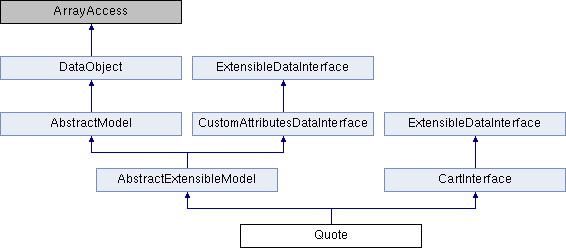
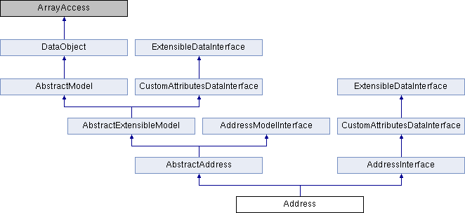
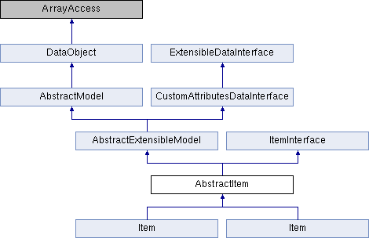
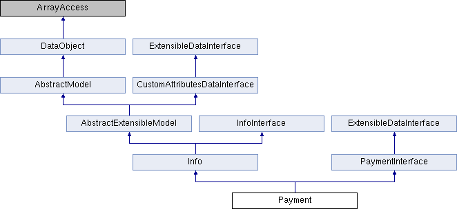

# 8.1 Применение квот, продуктов квоты, и правил корзины на чекауте

Квота содержит данные для создания ордера. Это временная информация и может быть изменена пользователем.
После создания квоты нельзя измененить данный квоты. По своему содержанию квота содержит те же данные, что и корзина.
Теоретически квота - это оффер для юзера на покупку, и если он его принимает (проходит все стэпы чекаута) она конвертируется в офер.
Для работы с квотами применяется модуль module-quote. Это один из модулей Магенто.

Для чего Магента создает квоты:

- для сохранения данных о продуктах в шопинг-карте вместе с инфой про цены, количество и опции
- для сохранения выбраного билинга и адреса шипинга
- для сохранения цен шипинг
- для сохранения промежуточных итоговых цен (к примеру, цен без учета налога), дополнительных цен (за доставку, налоги, ...) и купоны для расчета результирующей стоимости покупки
- для сохранения выбранного метода оплаты

Таблицы для сохранения квот в базе данных:

- quote
- quote_address
- quote_address_item
- quote_id_mask
- quote_item
- quote_item_option
- quote_payment
- quote_shipping_rate

Модель Корзины используется для манипулирования (добавление, удаление и обновление) элементов в квотах. 
Она выполняет дополнительную проверку, например установка минимального количества заказов для позиции, когда она добавляется в корзину.
Когда товар добавляется в корзину, вызывается метод _prepareProduct(), чтобы подготовить данные товара для хранения в квоте. 
Для простых товаров загружаются все данные товара в модель. 
Сгруппированный товар, например, загружает данные всех связанных товаров.
Для получения информации о товаре, например, специальных и настраиваемых параметров,
он превращается в объект /Magento/Sales/Quote/Item/Option и сохраняется в базе данных в таблице quote_item_option.

####Параметры потока оформления заказа

По умолчанию предусмотрено два варианта оформления заказа: одностраничный и с мульти-доставкой. 
В мульти-доставке товарные позиции добавляются к каждому адресу доставки (хотя виртуальные элементы добавляются к адресу оплаты), 
а не в конце оформления заказа для каждого адреса. 
Это отражается в базе данных, где эти позиции сохраняются в таблице quote_address_item, 
тогда как квоты одностраничного заказа в таблице quote_item.

Сгруппированные товары добавляются в корзину как несколько отдельных товаров, поэтому их можно выбирать для доставки на различные адреса, используя регулярный процесс мульти-доставки. 
Однако связанные товары (bundled) нельзя разделить между несколькими адресами.

####Модели квоты
Используемая модель для работы с квотами - Magento\Quote\Model\Quote



Используемая модель для работы с адрессными квотами - Magento\Quote\Model\Quote\Address.



Квота обычно содержит 2 адреса (биллинг и шиппинг), но может содержать и более, если есть несколько адресов доставки или нет ни одного.
Если квота не будет содержать адрес, то общая цена не будет зависить от прайс-рулов конкретной страны. 
Если квота содержит виртуальные продукты, то тогда также адрес доставки не будет учитываться
и будет вызван метод isVirtual(), для расчета общей цены, и только билинг-адрес будет браться во внимание. 
Для продуктов квоты применяется модель - Magento\Quote\Model\Quote\Item.



Для платежа - Magento\Quote\Model\Quote\Payment. 



####Модели тотала квоты

Квоты позиций, ценовые правила корзины и расходы на доставку составляют общую стоимость квоты.
Платежные адреса и адреса доставки также влияют на общую сумму, так как они используются для определения налоговых ставок, способов доставки и способов оплаты.
В моделях итога отслеживается стоимость заказа или квоты. 
Каждый из итогов имеет код, который связан с ним, который может быть использован для его получения и обработки. 
Модели итога обрабатывают адрес, чтобы добавить в коллекцию итоги для него. С помощью адреса модели получают доступ к квоте и квотам позиций.
Модели для расчета тотала можно расширить путем расширения класса \Magento\Quote\Model\Quote\Address\Total\AbstractTotal. 
Например, существующие модели тотала в чистой Магенто:

```xml
<config xmlns:xsi="http://www.w3.org/2001/XMLSchema-instance" xsi:noNamespaceSchemaLocation="urn:magento:module:Magento_Sales:etc/sales.xsd">
    <section name="quote">
        <group name="totals">
            <item name="subtotal" instance="Magento\Quote\Model\Quote\Address\Total\Subtotal" sort_order="100"/>
            <item name="shipping" instance="Magento\Quote\Model\Quote\Address\Total\Shipping" sort_order="350"/>
            <item name="grand_total" instance="Magento\Quote\Model\Quote\Address\Total\Grand" sort_order="550"/>
        </group>
    </section>
</config>
```

Порядок применения классов для подсчета тоталов управляется методом collectTotals класса \Magento\Quote\Model\Quote\Address\Total\Collector.

###Правила (рулы) на странице чекаута.

Рулы для корзины могут изменять финальную цену продуктов или цену доставки. Их можно создать сконфигурировать через админ панель. 
Можно создать купон для пересчета общей цены. Можно также создать дискаунт или бесплатный шипинг для карты. 
Все созданные рулы находятся по адресу Marketing->Cart Price Rules-> Add New Rule.
В отличие от ценовых правил каталога, ценовые правила корзины применяют изменения цены (скидки) на основе информации в квоте, например, 
группы клиентов, промо-кода, а не на основе товара или категории.
Можно применять рулы для: 

- комбинации аттрибутов продукта
- для определенных продуктов
- для комбинации условий
- для промежуточных условий
- общее количество продуктов
- общий вес
- платежный метод
- метод доставки
- почтовый индекс доставки
- регион адреса доставки
- штат/провинция адреса доставки
- страна доставки

Ограничение ценовых правил корзины включают:

Хотя для одной корзины может применяться несколько правил, одновременно может применяться только один промо-код.
Правила работают независимо друг от друга, поэтому правило не может быть указано как активное на основе других правил.
В панели администратора при просмотре заказов ценовые правила корзины могут быть отключены для определенных элементов, 
но они всегда применяются ко всем элементам во фронтэнде.

Для работы с такими рулами используется модель - Magento\SalesRule\Model\Rule. 
С помощью ее можно программно создать рулы или применять уже созданные.
Созданные рулы могут существенно влиять на время формирования результирующей стоимости покупки. 
Поэтому не рекомендуется иметь много активных рулов одновременно.

###Поля и методы квоты

Если установить в базе данных опцию trigger_recollect=1, то квота, сохраненная на стороне клиента, будет апдейтиться всякий раз, как цена на продукт, находящегося в квоте,
будет меняться или продукт станет недоступным. С версии 2.3 эта опция возвращается в состояние отключена после пересчета тотала для квоты. И его необходимо программно включать заново.
Тоже самое при изменении CatalogRules происходит пересчет квоты. Для этой цели есть методы - Magento\Quote\Model\ResourceModel markQuotesRecollectOnCatalogRules() и markQuotesRecollect().
Квоты также расширяемые через икстеншен-аттрибуты. Например, можно зарегистрировать икстеншен через файл extension_attributes.xml:
```
<extension_attributes for="Magento\Quote\Api\Data\CartInterface">
    <attribute code="shipping_assignments"
        type="Magento\Quote\Api\Data\ShippingAssignmentInterface[]" />
</extension_attributes>
```

Используя плагины для Quote Repository можно дополнить логикой методы репозитория afterLoad(), beforeSave(), или whenever(). Квоты не используют кастомные аттрибуты, т.к. они не EAV типа.

Кастомные аттрибуты для адресной квоты берутся из возвращаемого массива метода \Magento\Quote\Model\Quote\Address\CustomAttributeList getAttributes().
Для того чтобы имплементировать его необходимо использовать плагин.

Полезные методы Quote item:

- Magento\Quote\Model\Quote\Item checkData() вызывается после добавления продукта в корзину и апдейте опций
- Magento\Quote\Model\Quote\Item setQty() - содержит в себе код для валидации количества товара на складе
- Magento\Catalog\Model\Product\Type\AbstractType checkProductBuyState() - вызывается для проверки возможности покупки товара
- Magento\Quote\Model\Quote\Item setCustomPrice()
- Magento\Quote\Model\Quote\Item getCalculationPrice() - возвращает оригинальную цену товара до подсчета ее с учетом налогов
- Magento\Quote\Model\Quote\Item isChildrenCalculated() - если есть родительская квота и дочерняя, то проверяет все ли айтэмы подсчитаны
- Magento\Quote\Model\Quote\Item isShipSeparately() - проверяет можно ли каждый айтэм квоты отправлять отдельно или как единой посылкой
- Magento\Quote\Model\Quote\Item\Compare::compare - не добавляет нового продукта в квоту, а по-возможности изменяет количеств уже добавленных айтэмов
- Magento\Quote\Model\Quote\Item representProduct() - при добавлении нового продукта в квоту сравнивает существующие там продукты с новым продуктом, сверяет id и кастомные опции
- Magento\Quote\Model\Quote\Item compareOptions() - сверяет два массива с опциями. Первый массив - эталонный, а второй - сверяется относительно первого.

Способы проверки доступности товара на складе:

- При вызове метода Magento\Quote\Model\Quote\Item setQty() происходит проверка доступности товара на складе
- Подписавшись на ивент "sales_quote_item_qty_set_after" можно реализовать проверку доступности товара на складе
- Вызвав метод \Magento\CatalogInventory\Model\Quote\Item\QuantityValidator::validate для проверки доступности товара на складе

Способы добавления продуктов в карту:

- Вызвав метод Magento\Quote\Model\Quote addProduct(). Если продукт не может быть добавлен, то вернет ошибку.
- Вызвав метод Magento\Catalog\Model\Product\Type\AbstractType prepareForCartAdvanced() для подготовки добавления продукта в карту.
Есть более продвинутый метод Magento\Catalog\Model\Product\Type\AbstractType processMode().
- Вызвав метод Magento\Quote\Model\Quote\Item\Processor::prepare для установки количества и кастомных цен для продуктов квоты.
- Подписавшись на событие "sales_quote_product_add_after"
- Подписавшись на события "sales_quote_save_after", "sales_quote_save_before"
- Подписавшись на событие "checkout_cart_add_product_complete"

Способы апдейта карты:

- Вызвав метод \Magento\Quote\Model\Quote updateItemUpdate()
- Подписавшись на события "sales_quote_save_after", "sales_quote_save_before"

Как можно кастомизировать процесс добавления продукта в корзину:

- Реализовав плагин для метода \Catalog\Model\Product\Type\AbstractType prepareForCartAdvanced(). Он применяется для подготовки продукта к добавлению в корзину.
- Реализовав плагин для метода Magento\Quote\Model\Quote::addProduct
- Реализовав плагин для метода Magento\Quote\Model\Quote::addItem
- Подписавшись на событие "catalog_product_type_prepare_full_options" при условии полной валидации, или "catalog_product_type_prepare_lite_options" при условии частичной валидации.
- Реализовав плагин для метода Magento\Quote\Model\Quote\Item\Processor::prepare для установки количества и кастомных цен для продуктов квоты
- Подписавшись на событие "sales_quote_product_add_after" можно изменить значение аттрибута цены продукта
- Подписавшись на событие "sales_quote_add_item"
- В файле catalog_attributes.xml можно добавить аттрибут, который попадет в создаваемую квоту. Например:
```
<config xmlns:xsi="http://www.w3.org/2001/XMLSchema-instance" xsi:noNamespaceSchemaLocation="urn:magento:module:Magento_Catalog:etc/catalog_attributes.xsd">
    <group name="quote_item">
        <attribute name="sku"/>
        <attribute name="type_id"/>
        <attribute name="name"/>
        <attribute name="status"/>
        <attribute name="visibility"/>
        <attribute name="price"/>
        <attribute name="weight"/>
        <attribute name="url_path"/>
        <attribute name="url_key"/>
        <attribute name="thumbnail"/>
        <attribute name="small_image"/>
        <attribute name="tax_class_id"/>
        <attribute name="special_from_date"/>
        <attribute name="special_to_date"/>
        <attribute name="special_price"/>
        <attribute name="cost"/>
        <attribute name="gift_message_available"/>
    </group>
</config>
```

Возможные способы добавления продуктов в квоту:

- Добавление продуктов из каталога
- Добавление продуктов из вишлиста
- Создать ордер из админки
- Пересоздать ордер из админки
- Переконфигурация добавленного продукта в корзину путем изменения кастомных опций
- Если неавторизированный кастомер добавил товары в корзину, то при авторизации они останутся в квоте

###Программное создание квоты и ордера

К примеру, есть полноценный массив данных для создания сперва квоты, а потом из нее сконвертировать ордер:

```
<?php

$order = [
    'currency_id' => 'USD',
    'email' => 'hello@example.com',
    'shipping_address' => ['firstname' => 'John',
        'lastname' => 'Doe',
        'street' => 'xxxxxx',
        'city' => 'xxxxxxx',
        'country_id' => 'US',
        'region' => 'xxxxx',
        'postcode' => '85001',
        'telephone' => '52556542',
        'fax' => '3242322556',
        'save_in_address_book' => 1],
    'items' => [
        ['product_id' => '1', 'qty' => 1],
        ['product_id' => '2', 'qty' => 2]]
    ];
?>
```

Создадим хэлпер с методом для создания квоты из этих данных и конвертации в ордер:
```
<?php
namespaceYourNameSpace\ModuleName\Helper;
 
use Magento\Framework\App\Helper\AbstractHelper;
 
class Data extends AbstractHelper
{
    public function __construct(\Magento\Framework\App\Helper\Context $context, \Magento\Store\Model\StoreManagerInterface $storeManager, \Magento\Catalog\Model\Product $product, \Magento\Framework\Data\Form\FormKey $formkey, \Magento\Quote\Model\QuoteFactory $quote, \Magento\Quote\Model\QuoteManagement $quoteManagement, \Magento\Customer\Model\CustomerFactory $customerFactory, \Magento\Customer\Api\CustomerRepositoryInterface $customerRepository, \Magento\Sales\Model\Service\OrderService $orderService)
    {
        $this->storeManager = $storeManager;
        $this->product = $product;
        $this->formkey = $formkey;
        $this->quote = $quote;
        $this->quoteManagement = $quoteManagement;
        $this->customerFactory = $customerFactory;
        $this->customerRepository = $customerRepository;
        $this->orderService = $orderService;
        parent::__construct($context);
    }
 
    public function createOrder($order)
    {
      $store = $this->storeManager->getStore();
      $websiteId = $this->storeManager->getStore()->getWebsiteId();
      $customer = $this->customerFactory->create();
      $customer->setWebsiteId($websiteId);
      $customer->loadByEmail($order['email']); // load customet by email address
      
      if (!$customer->getEntityId()) {
          //If not avilable then create this customer
         $customer->setWebsiteId($websiteId)->setStore($store)->setFirstname($order['shipping_address']['firstname'])->setLastname($order['shipping_address']['lastname'])->setEmail($order['email'])->setPassword($order['email']);
          $customer->save();
      }
      $quote = $this->quote->create(); // Create Quote Object
      $quote->setStore($store); // Set Store
      $customer = $this->customerRepository->getById($customer->getEntityId());
      $quote->setCurrency();
      $quote->assignCustomer($customer); // Assign quote to Customer
      
      //add items in quote
      foreach ($order['items'] as $item) {
          $product = $this->product->load($item['product_id']);
          $product->setPrice($item['price']);
          $quote->addProduct($product, intval($item['qty']));
      }
      
      $quote->getBillingAddress()->addData($order['shipping_address']);
      $quote->getShippingAddress()->addData($order['shipping_address']);
      
      // Collect Rates and Set Shipping & Payment Method
      
      $shippingAddress = $quote->getShippingAddress();
      $shippingAddress->setCollectShippingRates(true)->collectShippingRates()->setShippingMethod('freeshipping_freeshipping');
      $quote->setPaymentMethod('checkmo');
      $quote->setInventoryProcessed(false);
      $quote->save();
      
      // Set Sales Order Payment
      $quote->getPayment()->importData(['method' => 'checkmo']);
      
      // Collect Totals & Save Quote
      $quote->collectTotals()->save();
      
      // Create Order From Quote
      $orderdata = $this->quoteManagement->submit($quote);
      
      $orderdata->setEmailSent(0);
      $increment_id = $order->getRealOrderId();
      
      if ($orderdata->getEntityId()) {
          $result['order_id'] = $orderdata->getRealOrderId();
      } else {
          $result = ['error' => 1, 'msg' => 'Your custom message'];
      }
      
      return $result;
    }
}
?>
```

###Как сконвертировать кастомное поле с квоты в ордер

1. Создаем кастомные аттрибуты для квоты и ордера. Например, в файле app/code/[Namespace]/[Module]/etc/extension_attributes.xml:
```
<config xmlns:xsi="http://www.w3.org/2001/XMLSchema-instance" xsi:noNamespaceSchemaLocation="Api/etc/extension_attributes.xsd">
    <extension_attributes for="Magento\Quote\Api\Data\CartInterface">
         <attribute code="testfield" type="string" />
    </extension_attributes>
    <extension_attributes for="Magento\Sales\Api\Data\OrderInterface">
         <attribute code="testfield" type="string" />
    </extension_attributes>
</config>
```

2. Создаем файл app/code/[Namespace]/[Module]/etc/fieldset.xml:
```
<config xmlns:xsi="http://www.w3.org/2001/XMLSchema-instance"
        xsi:noNamespaceSchemaLocation="urn:magento:framework:DataObject/etc/fieldset.xsd">
  <scope id="global">
    <fieldset id="sales_convert_quote">
      <field name="testfield">
        <aspect name="to_order" />
      </field>
    </fieldset>
  </scope>
</config>
```
3. Подписываемся на событие sales_model_service_quote_submit_before:
```
<config xmlns:xsi="http://www.w3.org/2001/XMLSchema-instance" xsi:noNamespaceSchemaLocation="urn:magento:framework:Event/etc/events.xsd">
    <event name="sales_model_service_quote_submit_before">
        <observer name="[Namespace]_[Module]_sales_model_service_quote_submit_before" instance="[Namespace]\[Module]\Observer\TestfieldObserver" />
    </event>
</config>
```
4. Создаем класс обзервера:
```
<?php

#app/code/[Namespace]/[Module]/Observer/TestfieldObserver.php

namespace Vendor\Module\Observer;
 
use Magento\Framework\Event\ObserverInterface;
 
class SaveOrderBeforeSalesModelQuoteObserver implements ObserverInterface
{
    protected $objectCopyService;
    public function __construct(
      \Magento\Framework\DataObject\Copy $objectCopyService,
    ) {
        $this->objectCopyService = $objectCopyService;
    }
 
    public function execute(\Magento\Framework\Event\Observer $observer)
    {
      $order = $observer->getEvent()->getData('order');
      $quote = $observer->getEvent()->getData('quote');
      $this->objectCopyService->copyFieldsetToTarget('sales_convert_quote', 'to_order', $quote, $order);
      return $this;
    }
}
```

Таким образом мы скопировали кастомное поле из квоты в ордер.