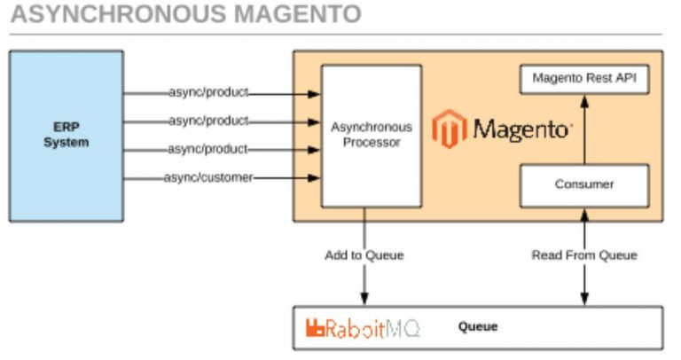
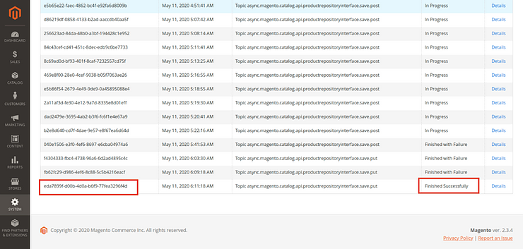

#Bulk API

Еще в 2018 году Magento сделала огромный шаг вперед со своим API. Однако было узкое место, которое привело к серьезным проблемам с производительностью и масштабируемостью. 
В системе не было оптимизированного массового API для импорта каталогов. В результате подключение к системам ERP было проблематичным. 
Чем больше продуктов было на сайте и чем чаще появлялись обновления, тем с большей сложностью сталкивались его владельцы.

Создание масштабируемого массового API стало проблемой номер один. Новый механизм должен быть достаточно мощным, чтобы обрабатывать многочисленные вычисления платформы и операции с базой данных, 
связанные с такими функциями, как многоуровневое и групповое ценообразование, несколько магазинов и валют, правила цен для каталога и корзины и т.д.

Magento создает массовую операцию для каждого асинхронного запроса. Это объект, который объединяет несколько операций. Кроме того, объект отслеживает агрегированный статус запросов.

Таким образом, основная часть одного асинхронного запроса состоит из одной операции. В свою очередь, асинхронный запрос приводит к сгенерированному Bulk UUID, который возвращает Magento. Разработчики используют его для отслеживания статуса массовых операций.

Внешняя платформа отправляет большое количество объектов, связанных с одной конечной точкой. 
Со старым API пришлось бы вызывать конечную точку несколько раз. Однако разработчики Comwrap предложили более эффективный алгоритм. 
Они предложили особый тип конечных точек API - Bulk API. Как это работает:

- Массовый API объединяет несколько сущностей, относящихся к одному типу, в массив.
- Массив участвует в единственном запросе API.
- Затем обработчик конечной точки разбивает массив на отдельные объекты.
- После этого он отправляет их отдельными сообщениями в очередь сообщений.



Для работы такого АПИ необходимо, чтобы был установлен и настроен брокер сообщений, например, RabbitMQ.
После его устаговки необходимо добавить данные конфигурации в файл app/etc/env.php. Например,
```
'queue' => [
'amqp' => [
  'host' => '127.0.0.1',
  'port' => '5672',
  'user' => 'username',
  'password' => 'password',
  'virtualhost' => '/'
 ],
] 
```

На данный момент все конечные точки уже реализованных АПИ-методов должны реализовывать массовую обработку данных.
Для этого к урле добавляется async/bulk. Например, если урла для апдейта одного продукта имеет вид http://{domain}/rest/all/V1/products/:sku, то для массового апдейта нескольких продуктов, используя Bulk API, 
урла будет иметь вид http://{domain}/rest/{опционально айди стора}/async/bulk/V1/products/bySku.

При этом в теле POST-запроса будет присутствовать массив продуктов для изменения. Например:
```
[
{
  "product": {
    "sku": "sku1",
    "name": "Product1",
    "attribute_set_id": 4,
    "status": 1,
    "visibility": 4,
    "price":10,
    "type_id": "simple",
    "extension_attributes": {
      "stock_item": {
      "item_id": 3072,
      "product_id": 3073,
      "stock_id": 1,
      "qty": 20,
      "is_in_stock": true
      }
    },
    "custom_attributes": [
      {
        "attribute_code": "part_number",
        "value": "1234"
      }
    ]    
  }
},
{
  "product": {
    "sku": "3483",
    "name": "Product2",
    "attribute_set_id": 4,
    "status": 1,
    "visibility": 4,
    "price":20,
    "type_id": "simple",
    "extension_attributes": {
      "stock_item": {
        "item_id": 3071,
        "product_id": 3072,
        "stock_id": 1,
        "qty": 10,
        "is_in_stock": true
      }
    },
    "custom_attributes": [
      {
        "attribute_code": "part_number",
        "value": "1234"
      }
    ]
  }
}
] 
```

При успешной постановки данных в очередь для дальнейшей передачи их отдельно в брокер-сообщений прийдет ответ:
```
{
    "bulk_uuid": "eda7899f-d00b-4d0a-b6f9-77fea3296f4d",
    "request_items": [
        {
            "id": 0,
            "data_hash": "986765adeb0b00b03997159b84b627f5c5eda5e281b52dc34d61446cc496ebf3",
            "status": "accepted"
        },
        {
            "id": 1,
            "data_hash": "3ae299b09bd30686772ee24214b482d88776f49f68ce804b1e78dfc4c1d19802",
            "status": "accepted"
        }
    ],
    "errors": false
} 
```

Если крон сконфигурирован и запущен, тогда обработчики будут запускаться им. Если нет - то необходимо запустить их из командной строки.
```
php bin/magento queue:consumers:start async.operations.all 
```

Логи всех операций связанных с массовой обработкой данных можно мониторить в админке Admin -> System -> Bulk Action Log.
По сгенерированному в ответе bulk_uuid можно определить состояние запроса. Например:

