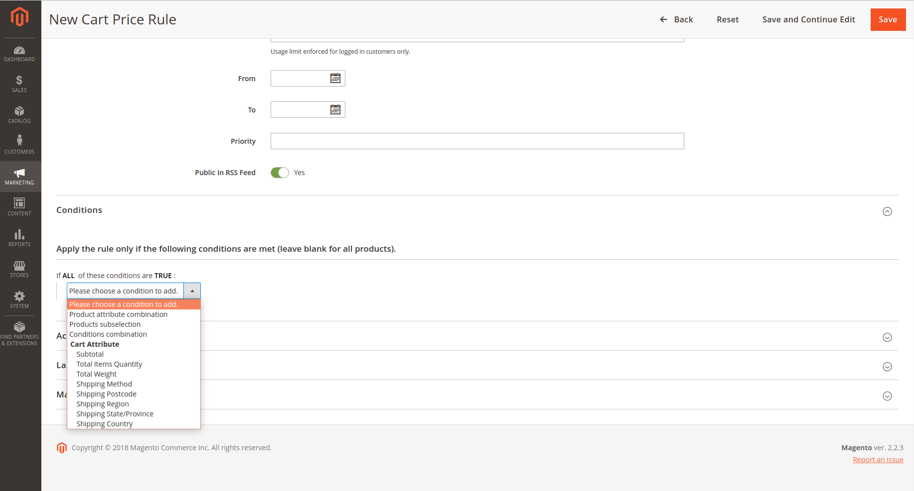

#Кастомизация прайс рулов корзины

Для создания дискаунтов в админке существует интерфейс Admin panel -> Marketing -> Cart Sales Rules. Есть различные опции и условия, которые можно применять к корзине. Но можно создавать свои условия.
Например, создадим условие, что если залогиненный кастомер впервые совершает покупку, то он получает дискаунт.

Что необходимо создать программно в модуле, чтобы можно было создавать рулы в админке с подобным условием:

1. Подписаться на событие salesrule_rule_condition_combine. В файле app/code/[Vendor]/[Module]/etc/events.xml:
```xml
<?xml version="1.0"?>
<config xmlns:xsi="http://www.w3.org/2001/XMLSchema-instance" xsi:noNamespaceSchemaLocation="urn:magento:framework:Event/etc/events.xsd">
    <event name="salesrule_rule_condition_combine">
        <observer name="customer_rule" instance="[Vendor]/[Module]\Observer\CustomerConditionObserver" />
    </event>
</config>
```

2. Создаем сам обзервер:
```
<?php

//file: app/code/[Vendor]/[Module]/Observer/CustomerConditionObserver.php

namespace [Vendor]/[Module]\Observer;

/**
 * Class CustomerConditionObserver
 */
class CustomerConditionObserver implements \Magento\Framework\Event\ObserverInterface
{
    /**
     * Execute observer.
     * @param \Magento\Framework\Event\Observer $observer
     * @return $this
     */
    public function execute(\Magento\Framework\Event\Observer $observer)
    {
        $additional = $observer->getAdditional();
        $conditions = (array) $additional->getConditions();

        $conditions = array_merge_recursive($conditions, [
            $this->getCustomerFirstOrderCondition()
        ]);

        $additional->setConditions($conditions);
        return $this;
    }

    /**
     * Get condition for customer first order.
     * @return array
     */
    private function getCustomerFirstOrderCondition()
    {
        return [
            'label'=> __('Customer first order'),
            'value'=> \[Vendor]/[Module]\Model\Rule\Condition\Customer::class
        ];
    }
}
```

В методе execute мы мерджим все существующие опции с нашей опцией 'Customer first order'. Эта опция появится в дропдауне вместе с остальными, когда мы будем создавать условие для нашего рула.


В методе getCustomerFirstOrderCondition формируем название, которое будет в дропдауне, и класс-обработчик нашего условия.

3. Добавляем в контейнер зависимостей наш класс обработчик:
```
<?xml version="1.0"?>
<config xmlns:xsi="http://www.w3.org/2001/XMLSchema-instance" xsi:noNamespaceSchemaLocation="urn:magento:framework:ObjectManager/etc/config.xsd">
    <type name="[Vendor]/[Module]\Model\Rule\Condition\Customer">
        <arguments>
            <argument name="data" xsi:type="array">
                <item name="form_name" xsi:type="string">sales_rule_form</item>
            </argument>
        </arguments>
    </type>
</config>
```

4. Реализуем сам класс-обработчик:
```
<?php

#app/code/[Vendor]/[Module]/Model/Rule/Condition/Customer.php

namespace [Vendor]/[Module]\Model\Rule\Condition;

/**
 * Class Customer
 */
class Customer extends \Magento\Rule\Model\Condition\AbstractCondition
{
    /**
     * @var \Magento\Config\Model\Config\Source\Yesno
     */
    protected $sourceYesno;

    /**
     * @var \Magento\Sales\Model\ResourceModel\Order\CollectionFactory
     */
    protected $orderFactory;

    /**
     * Constructor
     * @param \Magento\Rule\Model\Condition\Context $context
     * @param \Magento\Config\Model\Config\Source\Yesno $sourceYesno
     * @param \Magento\Sales\Model\ResourceModel\Order\CollectionFactory $orderFactory
     * @param array $data
     */
    public function __construct(
        \Magento\Rule\Model\Condition\Context $context,
        \Magento\Config\Model\Config\Source\Yesno $sourceYesno,
        \Magento\Sales\Model\ResourceModel\Order\CollectionFactory $orderFactory,
        array $data = []
    ) {
        parent::__construct($context, $data);
        $this->sourceYesno = $sourceYesno;
        $this->orderFactory = $orderFactory;
    }

    /**
     * Load attribute options
     * @return $this
     */
    public function loadAttributeOptions()
    {
        $this->setAttributeOption([
            'customer_first_order' => __('Customer first order')
        ]);
        return $this;
    }

    /**
     * Get input type
     * @return string
     */
    public function getInputType()
    {
        return 'select';
    }

    /**
     * Get value element type
     * @return string
     */
    public function getValueElementType()
    {
        return 'select';
    }

    /**
     * Get value select options
     * @return array|mixed
     */
    public function getValueSelectOptions()
    {
        if (!$this->hasData('value_select_options')) {
            $this->setData(
                'value_select_options',
                $this->sourceYesno->toOptionArray()
            );
        }
        return $this->getData('value_select_options');
    }

    /**
     * Validate Customer First Order Rule Condition
     * @param \Magento\Framework\Model\AbstractModel $model
     * @return bool
     */
    public function validate(\Magento\Framework\Model\AbstractModel $model)
    {
        $customerId = $model->getCustomerId();
        $order = $this->orderFactory->create()
            ->addAttributeToSelect('customer_id')
            ->addFieldToFilter('customer_id',['eq' => $customerId])
            ->getFirstItem();

        $firstOrder = 1;
        if ($order->getId()) {
            $firstOrder = 0;
        }
        $model->setData('customer_first_order', $firstOrder);
        return parent::validate($model);
    }
}
```

Метод validate устанавливает значение кастомного аттрибута customer_first_order в состояние true или false, на основании
которого в дальнейшем проверяется можно или нет елать кастомный дискаунт на основании нами созданного условия.