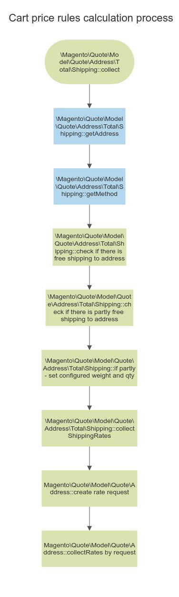

# Создание кастомного метода доставки

###Транспортировка, методы, запросы и результаты

Carrier отвечает за транспортную компанию (к примеру, DPD, FedEx и так далее). 
У каждой компании может быть один и больше методов доставки, которые будут содержать код перевозчика, заголовок, код метода, 
заголовок метода, а также стоимость, которую должен будет уплатить покупатель и стоимость, которую должен будет уплатить предприниматель (опционально).

В процессе проведения оплаты, Magento создает объект “request” на ставку оплаты, который содержит всю нужную информацию о доставке. Этот запрос может быть использован для определения применяемых издержек. К примеру, “express”-доставка не может быть применена к заказам дешевле 10$. Затем все применяемые ставки “прикрепляются” к объекту “result”, который генерирует список методов, из которых покупатель может выбирать.

В следующем списке представлены названия классов, которые принимают учавствие в расчете цены доставки:

* Request
  Magento\Quote\Model\Quote\Address\RateRequest

* Result
  Magento\Shipping\Model\Rate\Result

* Method
  Magento\Quote\Model\Quote\Address\RateResult\Method

* Carrier
  Любой класс, который дополняет абстрактный класс \Magento\Shipping\Model\Carrier\AbstractCarrier и реализует интерфейс \Magento\Shipping\Model\Carrier\CarrierInterface.
  
###Создание кастомного метода доставки

1. Создаем файл с настройками метода доставки /etc/config.xml

```xml
<?xml version="1.0"?>
<config xmlns:xsi="http://www.w3.org/2001/XMLSchema-instance" xsi:noNamespaceSchemaLocation="urn:magento:module:Magento_Store:etc/config.xsd">
    <default>
        <carriers>
            <simpleshipping>
                <active>1</active>
                <sallowspecific>0</sallowspecific>
                <model>Magento\Simpleshipping\Model\Carrier\Shipping</model>
                <name>Sample Shipping Method</name>
                <price>10.00</price>
                <title>Sample Shipping Method</title>
                <specificerrmsg>This shipping method is not available. To use this shipping method, please contact us.</specificerrmsg>
            </simpleshipping>
        </carriers>
    </default>
</config>
```

2. Создаем модель /Model/Carrier/Shipping.php. 
Модель должна имплементировать интерфейс \Magento\Shipping\Model\Carrier\CarrierInterface и тем самым реализовывать метод этого интерфейса collectRates.
   
3. Создаем файл с настройками в админке метода доставки /etc/adminhtml/system.xml.

```xml
<?xml version="1.0"?>
<config xmlns:xsi="http://www.w3.org/2001/XMLSchema-instance" xsi:noNamespaceSchemaLocation="urn:magento:module:Magento_Config:etc/system_file.xsd">
    <system>
        <section id="carriers" translate="label" type="text" sortOrder="320" showInDefault="1" showInWebsite="1" showInStore="1">
            <group id="simpleshipping" translate="label" type="text" sortOrder="0" showInDefault="1" showInWebsite="1" showInStore="1">
                <label>Mageplaza Simple Shipping Method</label>
                <field id="active" translate="label" type="select" sortOrder="1" showInDefault="1" showInWebsite="1" showInStore="0" canRestore="1">
                    <label>Enabled</label>
                    <source_model>Magento\Config\Model\Config\Source\Yesno</source_model>
                </field>
                <field id="name" translate="label" type="text" sortOrder="3" showInDefault="1" showInWebsite="1" showInStore="1" canRestore="1">
                    <label>Method Name</label>
                </field>
                <field id="price" translate="label" type="text" sortOrder="5" showInDefault="1" showInWebsite="1" showInStore="0" canRestore="1">
                    <label>Price</label>
                    <validate>validate-number validate-zero-or-greater</validate>
                </field>
                <field id="handling_type" translate="label" type="select" sortOrder="7" showInDefault="1" showInWebsite="1" showInStore="0" canRestore="1">
                    <label>Calculate Handling Fee</label>
                    <source_model>Magento\Shipping\Model\Source\HandlingType</source_model>
                </field>
                <field id="handling_fee" translate="label" type="text" sortOrder="8" showInDefault="1" showInWebsite="1" showInStore="0">
                    <label>Handling Fee</label>
                    <validate>validate-number validate-zero-or-greater</validate>
                </field>
                <field id="sort_order" translate="label" type="text" sortOrder="100" showInDefault="1" showInWebsite="1" showInStore="0">
                    <label>Sort Order</label>
                </field>
                <field id="title" translate="label" type="text" sortOrder="2" showInDefault="1" showInWebsite="1" showInStore="1" canRestore="1">
                    <label>Title</label>
                </field>
                <field id="sallowspecific" translate="label" type="select" sortOrder="90" showInDefault="1" showInWebsite="1" showInStore="0" canRestore="1">
                    <label>Ship to Applicable Countries</label>
                    <frontend_class>shipping-applicable-country</frontend_class>
                    <source_model>Magento\Shipping\Model\Config\Source\Allspecificcountries</source_model>
                </field>
                <field id="specificcountry" translate="label" type="multiselect" sortOrder="91" showInDefault="1" showInWebsite="1" showInStore="0">
                    <label>Ship to Specific Countries</label>
                    <source_model>Magento\Directory\Model\Config\Source\Country</source_model>
                    <can_be_empty>1</can_be_empty>
                </field>
                <field id="showmethod" translate="label" type="select" sortOrder="92" showInDefault="1" showInWebsite="1" showInStore="0">
                    <label>Show Method if Not Applicable</label>
                    <source_model>Magento\Config\Model\Config\Source\Yesno</source_model>
                    <frontend_class>shipping-skip-hide</frontend_class>
                </field>
                <field id="specificerrmsg" translate="label" type="textarea" sortOrder="80" showInDefault="1" showInWebsite="1" showInStore="1" canRestore="1">
                    <label>Displayed Error Message</label>
                </field>
            </group>
        </section>
    </system>
</config>
```

Схема подсчета возможных способов доставки.


