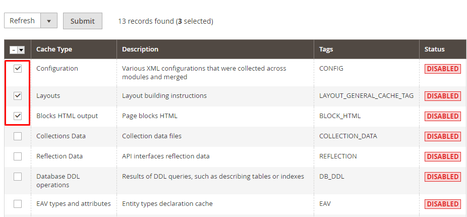

#Обзор full page cache

###Как работает веб-кэш

Все виды кэшей обладают определенным набором правил, которые они используют, чтобы определить, 
когда брать контент из кэша, если он доступен. Некоторые из эти правил установлены протоколами (HTTP 1.0/HTTP 1.1), 
некоторые — администраторами кэша (пользователями браузера или администраторами прокси).

Общие правила:

1. Если заголовки ответа сообщают кэшу не сохранять их, он не сохранит.
2. Если запрос авторизованный (authorized) или безопасный (то есть, HTTPS), он не будет закэширован.
3. Кэшированный контент считается 'свежим' (то есть, может быть отправлен клиенту без проверки с исходного сервера), если:
- У него установлено время истечения или другой заголовок, контролирующий время жизни, и он еще не истек.
- Если кэш недавно проверял контент и тот был модифицирован достаточно давно.

Свежий контент берется непосредственно из кэша, без проверки с сервера.
4. Если контент является устаревшим, исходному серверу будет предложено провалидировать его или сообщить кэшу, является ли имеющаяся копия по-прежнему актуальной.
5. При определенных обстоятельствах — например, когда он отключен от сети — кэш может сохранять устаревшие ответы без проверки с исходного сервера.

Если в ответе не присутствует валидатора (ETag или Last-Modified заголовок), и он не содержит никакой явной информации о свежести, контент, обычно (но не всегда) будет считаться некэшируемым.

Свежесть (freshness) и валидация (validation) являются наиболее важными способами, с помощью которых кэш работает с контентом. Свежий контент будет доступен мгновенно из кэша; валидное же содержимое избежит повторной отправки всех пакетов, если оно не было изменено.

Magento - это e-commerce движок довольно требователен к железу. 
Но разработчики этого интернет-магазина попытались решить эту проблему и придумали много различного рода «ускорялок», 
без которых запускать магазин на движке Magento в продакшн не стоит. Слишком долго Magento будет отдавать конечному пользователю страницу. 
Среди таких «ускорялок» кеши, индексы, компиляция, объединение JS/CSS в один сжатый файл и др.
Одной из основных особенностей Magento является Full Page Cache(FPC). Эту «фишку» реализует модуль Magento_PageCache.
FPC позволяет отдавать серверу страницу за считанные миллисекунды, практически не нагружая сервер. 
Примеры времени отдачи страницы продукта сервером в мс:


Как следует из названия, Full Page Cache кеширует полностью всю страницу. Но кеширует не все страницы. Как минимум потому, что для этого нет смысла. По умолчанию кешируются только страницы продукта, страницы категории, CMS-страницы и страница с 404 ошибкой (страница не найдена). 

Пример работы модуля кэширования, основаный на Built-in cache или Varnish cache:


Т.е. браузер отправляет запрос на Варнишь. Тот анализирует сможет ли он отдать контент без рендеринга его на стороне бэкэнда Магенто.
Если сможет - то он отдает его из своего хранилища для кэша. Если нет - обращается на бэкэнд для рендеринга его.
В зависимости от хэдэров, пришедших вместе с контентом от бэкэнда, он или кэширует его для дальнейшей отдачи на такой же запрос, или нет.

###Настройки кеширования

Stores — c — System — Full Page Cache

На выбор предлагается 2 опции: Built-in cache и Varnish cache


Built-in cache — встроенный кеш, Varnish cache — это HTTP ускоритель предназначенный для обслуживания динамических веб-сайтов, и сайтов имеющих API.
Опция varnish помечена как recommended, т.к. varnish cache гораздо производительнее встроенного built-in. По этому крайне важно не забыть включить и настроить varnish на сервере, и включить его в Magento.

###Основные команды работы с кэшем

1. Для проверки состояния всех доступных видов кэшей:

```
 bin/magento cache:status
```

Пример вывода:

```
                config: 1
                layout: 1
            block_html: 1
           collections: 1
            reflection: 1
                db_ddl: 1
       compiled_config: 1
                   eav: 1
 customer_notification: 1
    config_integration: 1
config_integration_api: 1
        google_product: 1
             full_page: 1
     config_webservice: 1
             translate: 1
                vertex: 1
```

Как мы видим full_page включен.

2. Для включения/выключения определенных типов кэшей:

```
bin/magento cache:enable [type] ... [type]
bin/magento cache:disable [type] ... [type]
```

3. Для очистки кэша или полного сброса:

```
bin/magento cache:clean [type] ... [type]
bin/magento cache:flush [type] ... [type]
```

Вышеописанные операции с кэшем можно осуществлять в админке System > Tools > Cache Management




###Работа с кэшем в developer режиме

Для проверки работы сайта в процесссе его разработки бэкэнд отправляет хэдэры X-Magento-Cache-*.
Например, есть хэдэр X-Magento-Cache-Debug, который имеет значение HIT или MISS.
Если X-Magento-Cache-Debug: MISS, то это говорит о том, что контент был взят не из Варниша, 
а запрос был отправлен на бэкэнд для его рендеринга. При этом время загрузки сайта достаточно большое:


Если X-Magento-Cache-Debug: HIT, то это говорит о том, что контент был взят из Варниша,
а запрос не был отправлен на бэкэнд для его рендеринга. При этом время загрузки сайта достаточно низкое:


