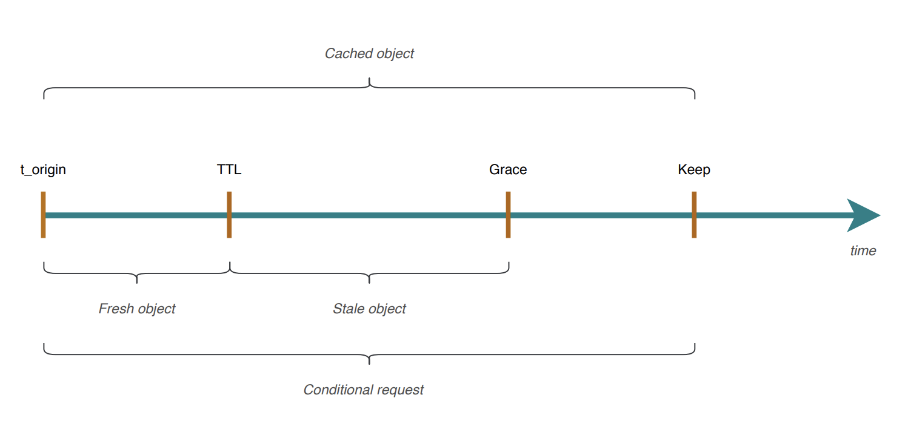

#Типы кэшей FPC

Все страницы в Магенто по умолчанию кэшируемые. Способы сделать страницу не кэшируемой:

1. Внедрить на страницу блок, который не подлежит кэшированию:

```xml
<?xml version="1.0"?>

<page xmlns:xsi="http://www.w3.org/2001/XMLSchema-instance" layout="1column" xsi:noNamespaceSchemaLocation="urn:magento:framework:View/Layout/etc/page_configuration.xsd">
   <referenceContainer name="content">

       <block class="Vendor\Namespace\Block\Index" name="fpc_index_index" template="Vendor_Namespace::index.phtml" cacheable="false"/>

   </referenceContainer>
</page>
```

cacheable="false" обозначает, что страница, на которой этот блок рендерится, не будет кэшироваться в FPC. 

2. Отправлять хэдэры, которые контролируют кэширование. Работает только с Варнишем:

```
header('Cache-Control: no-store, no-cache, must-revalidate, post-check=0, pre-check=0');
```

Существует 5 типов блоков с точки зрения кэшируемости в FPC:

1. Кэшируемые блоки

Когда их применять:

- блок часто используется. Например, один и тот же блок с тем же контентом отображается на различных страницах
- блок кэшируется на не кэшируемой странице

Способы указания параметров кэширования:

- указанием значения аргумента cache_lifetime в лэйауте:

```
<block class="MyBlock">
    <arguments>
        <argument name="cache_lifetime" xsi:type="number">3600</argument>
    </arguments>
</block>
```

- через DI:

```
<type name="MyBlock">
    <arguments>
        <argument name="data" xsi:type="array">
            <item name="cache_lifetime" xsi:type="number">3600</item>
        </argument>
    </arguments>
</type>
```

- императивным подходом:

```
$block->setCacheLifetime(3600);
$block->setData('cache_lifetime', 3600);
```

- переопределением метода:

```
class MyBlock extends AbstractBlock
{
    protected function getCacheLifetime()
    {
        return 3600;
    }
}
```

2. Не кэшируемые блоки

По умолчанию все блоки - не кэшируемые. Т.е. если нет для блока параметра cache_lifetime или стоит значение меньше 0 - значит блок не кэшируемый.

3. Блоки, которые не дают странице никогда попасть в Full Page Cache. Если у блока стоит значение аттрибута равное false, значит вся страница, на ктотрой находится блок, не попадет в FPC никогда.

```xml
<?xml version="1.0"?>

<page xmlns:xsi="http://www.w3.org/2001/XMLSchema-instance" layout="1column" xsi:noNamespaceSchemaLocation="urn:magento:framework:View/Layout/etc/page_configuration.xsd">
   <referenceContainer name="content">

       <block class="Vendor\Namespace\Block\Index" name="fpc_index_index" template="Vendor_Namespace::index.phtml" cacheable="false"/>

   </referenceContainer>
</page>
```

4. Приватные блоки

Если у блока стоит свойство _isScopePrivate равное true, тогда блок приватный. Такие блоки рендерятся в 2 этапа:

- в отрендеренном контенте ставится плейсхолдер для приватного блока
- затем браузер делает AJAX-запрос на получения данных и заменяет результатом плейсхолдер

Такие блоки используются, когда необходимо отрендерить приватные данные, например сессионнные данные пользователя, его имя, его балланс ...

Необходимо в блоке установить:

```
$this->_isScopePrivate = true;
```

5. ESI-блоки (shared-блоки)

Эти блоки работают только с установленным Варнишем. Если у блока стоит свойство ttl больше 0, тогда он подлежит кэшированию со стороны Варниш.
Эти блоки могут иметь время кэширования отличное от времени кэширования страницы, на которой они находятся. 
Команда сброса FPC кэша не влияет на такие блоки. Необходимо только вызывать команду полной очистки кэша для сброса этих блоков в Варнише.

Для того, чтобы установить время жизни блока, необходимо в лэйауте для блока установить аттрибут ttl:

```
<block class="MyBlock" ttl="3600"/>
```
Тем самым блок становится ESI-блоком (shared-блоком).

Такой блок становится ESI-тэгом в отрендеренной странице бэкэндом. Смотри метод \Magento\PageCache\Observer\ProcessLayoutRenderElement::_wrapEsi.

Пример использования таких блоков - например у нас есть кэшируемая cms-страница. На ее странице есть ESI-блок, который необходимо обновлять гораздо чаще, чем саму страницу.

Если указать время жизни блока меньше, чем Grace-время Варниша, то блок будет обновляться все-равно по времени равным или больше, чем значение Grace-время. Потому что Варниш конфигурируется так, что у него постоянное время, в течении которого он не сбрасывает кэш любого объекта.
Если истекло ttl-время блока, он делает запрос к бэку и получает от него свежий контент блока, но он все равно его не отдает браузеру пока не истечет его Grace-время. 
Поэтому не стоит помещать много ESI-блоков на страницу, потому что каждый раз когда заканчивается время ttl - Варнишь при каждом запросе спрашивает бэкэнд про новый контент блока до истечения установленного для Варниша Grace-время. Это нагружает бэкэнд и тем самым система кэширования наоборот будет препятствовать оптимизации времени отдачи страницы бэкэндом браузеру.



####Customer Session Depersonalization

Magento очищает хранилище сессионных данных для кешируемых запросов, чтобы избежать кеширования личного контента клиента. Это указывает на то, что мы не должны обращаться к данным сеанса клиента при обработке запроса 
GET, предназначенного для рендеринга кэшируемой страницы. 
Вот почему, например, при отображении страницы просмотра продукта, которая по умолчанию кэшируется, попробуйте проверить, вошел ли клиент в систему. Вы всегда будете получать false.

Например, один из классов Depersonalization для кастомерских данных - Magento\Customer\Model\Layout\DepersonalizePlugin. 
Это самый важный плагин для очистки кастомерских данных перед рендерингом любой кэшируемой страницы. Реализует 2 метода:
- beforeGenerateXml - собирает все данные, которые будут использоваться если произойдет очистка хранилища сессионных данных
- afterGenerateXml - удаляет кастомерские данные из хранилища сессионных данных и восстанавливает в нем раннее сохраненные данные в методе beforeGenerateXml

Проверка необходимости очистки персональных кастомерских данных происходит в методе \Magento\PageCache\Model\DepersonalizeChecker::checkIfDepersonalize.

Список реализованных DepersonalizePlugin:


<table>
<tbody>
<tr>
<th style="padding: 15px; border: 1px solid #e0e1e2; background: #fafafa;">Name</th>
<th style="padding: 15px; border: 1px solid #e0e1e2; background: #fafafa;">Class</th>
</tr>
<tr>
<td style="padding: 15px; border: 1px solid #e0e1e2; background: #fafafa;">catalog-session-depersonalize</td>
<td style="padding: 15px; border: 1px solid #e0e1e2; background: #fafafa;">Magento\Catalog\Model\Layout\DepersonalizePlugin</td>
</tr>
<tr>
<td style="padding: 15px; border: 1px solid #e0e1e2; background: #fafafa;">checkout-session-depersonalize</td>
<td style="padding: 15px; border: 1px solid #e0e1e2; background: #fafafa;">Magento\Checkout\Model\Layout\DepersonalizePlugin</td>
</tr>
<tr>
<td style="padding: 15px; border: 1px solid #e0e1e2; background: #fafafa;">core-session-depersonalize</td>
<td style="padding: 15px; border: 1px solid #e0e1e2; background: #fafafa;">Magento\PageCache\Model\Layout\DepersonalizePlugin</td>
</tr>
<tr>
<td style="padding: 15px; border: 1px solid #e0e1e2; background: #fafafa;">persistent-session-depersonalize</td>
<td style="padding: 15px; border: 1px solid #e0e1e2; background: #fafafa;">Magento\Persistent\Model\Layout\DepersonalizePlugin</td>
</tr>
<tr>
<td style="padding: 15px; border: 1px solid #e0e1e2; background: #fafafa;">tax-session-depersonalize</td>
<td style="padding: 15px; border: 1px solid #e0e1e2; background: #fafafa;">Magento\Tax\Model\Layout\DepersonalizePlugin</td>
</tr>
<tr>
<td style="padding: 15px; border: 1px solid #e0e1e2; background: #fafafa;">customer-session-depersonalize</td>
<td style="padding: 15px; border: 1px solid #e0e1e2; background: #fafafa;">Magento\Customer\Model\Layout\DepersonalizePlugin</td>
</tr>
</tbody>
</table>

