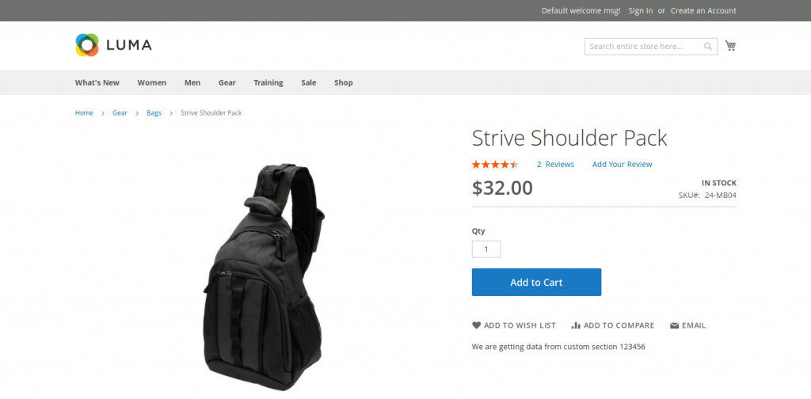

#Кэширование приватного контента используя Customer Sections

Использование механизма кэширования с указанием переменной _isScopePrivate равной true для кэшируемого блока сказывается на производительности сайта.
Также для такого кэширования можно использовать кастомные секции, которые уже реализованы в Магенто, например, для сохранения данных о кастомере, его фаворитных продуктах, корзины.
Т.е. можно расширять данный функционал для сохранения любых кастомных данных и дальнейшем рендеринге их при каждом их апдейте в локалсторедже.
Пример кэширования в модуле произвольных данных, применяя механизм Customer Sections:

1. Создаем класс в модуле, который будет имплементировать интерфейс SectionSourceInterface и возвращать касмерские данные реализованным методом getSectionData:
```
<?php

namespace [Vendor]\[Module]\CustomerData;

use Magento\Customer\CustomerData\SectionSourceInterface;

class CustomSection implements SectionSourceInterface
{
    public function getSectionData(): array
    {
    	return [
        	'customdata' => "We are getting data from custom section",
    	];
    }
}
```

2. Добавляем его в di.xml - добавляем новую секцию в объект SectionPool к уже существующим секциям:
```
<?xml version="1.0"?>
<config xmlns:xsi="http://www.w3.org/2001/XMLSchema-instance"
    	xsi:noNamespaceSchemaLocation="urn:magento:framework:ObjectManager/etc/config.xsd">
    <type name="Magento\Customer\CustomerData\SectionPool">
    	<arguments>
        	<argument name="sectionSourceMap" xsi:type="array">
            	<item name="custom_section" xsi:type="string">[Vendor]\[Module]\CustomerData\CustomSection</item>
        	</argument>
    	</arguments>
    </type>
</config>
```

3. Создаем лэйаут app/code/[Vendor]/[Module]/view/frontend/layout/catalog_product_view.xml, чтобы выввести эти данные на странице продукта:
```
<?xml version="1.0"?>
<page xmlns:xsi="http://www.w3.org/2001/XMLSchema-instance" xsi:noNamespaceSchemaLocation="urn:magento:framework:View/Layout/etc/page_configuration.xsd">
    <body>
    	<referenceContainer name="product.info.main">
        	<block class="Magento\Catalog\Block\Product\View" name="vendor_module_section" after="-" template="[Vendor]_[Module]::custom_section.phtml" />
    	</referenceContainer>
    </body>
</page>
```

4. Создаем темплейт app/code/[Vendor]/[Module]/view/frontend/templates/custom_section.phtml для рендеринга данных и запроса их из кастомерской секции:
```
<div class="aureatelabs-custom-section"data-bind="scope: 'section'">
    <p data-bind="text: customsection().customdata"></p>
</div>
<script type="text/x-magento-init">
    {
    	"*": {
        	"Magento_Ui/js/core/app": {
            	"components": {
                	"section": {
                    	"component": "Aureatelabs_CustomSection/js/section"
                	}
            	}
        	}
    	}
    }
</script>
```
5. Создаем модуль app/code/[Vendor]/[Module]/view/frontend/web/js/section.js для получения кастомерских данных:
```
define([
    'uiComponent',
    'Magento_Customer/js/customer-data'
], function (Component, customerData) {
    'use strict';

    return Component.extend({
    	initialize: function () {
        	this._super();
        	this.customsection = customerData.get('custom_section');
    	}
    });
});
```

Полученные кастомерские данные на странице продукта:



Данные получаются от сервера через Ajax-запрос и кэшируются в локалсторедже на 60 минут. При дальнейшем обращении к ним они берутся из него и запрос на сервер не делается.

Когда на сервер уходят запросы типа POST, PUT, DELETE -  Магенто подразумевает что идет обновление кастомных данных на сервере и каждый раз инициирует Ajax-запрос на обновление кастомных данных в локалсторедже.

Т.е. идет нагрузка на сервер и на браузер.

Чтобы избежать этого можно задать какие кастоомные данные должны апдейтиться каждый раз при POST, PUT, DELETE запросах на определенные урлы.
Например, в файле Magento/Catalog/etc/frontend/sections.xml говорится, что при запросе на урлы catalog/product_compare/add, catalog/product_compare/remove, catalog/product_compare/clear кастомерские данные в секции compare-products локалсторедж должны апдейтиться с сервера:
```
<?xml version="1.0"?>
<config xmlns:xsi="http://www.w3.org/2001/XMLSchema-instance"
    	xsi:noNamespaceSchemaLocation="urn:magento:module:Magento_Customer:etc/sections.xsd">
    <action name="catalog/product_compare/add">
    	<section name="compare-products"/>
    </action>
    <action name="catalog/product_compare/remove">
    	<section name="compare-products"/>
    </action>
    <action name="catalog/product_compare/clear">
    	<section name="compare-products"/>
    </action>
    <action name="customer/account/logout">
    	<section name="recently_viewed_product"/>
    	<section name="recently_compared_product"/>
    </action>
</config>
```

Для того, чтобы апдейтить данные секций при каждой перезагрузки страницы мы должны самостоятельно форсить этот апдейт путем добавления вызова метода в файл app/code/[Vendor]/[Module]/view/frontend/web/js/section.js:
```
customerData.reload('custom_section');
```