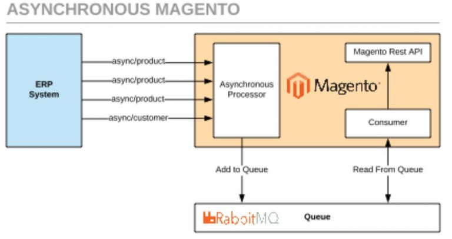

#Проблема массового импорта в Магенто 2

Еще в 2018 году Magento сделала огромный шаг вперед со своим API. Однако было узкое место, которое привело к серьезным проблемам с производительностью и масштабируемостью. 
В системе не было оптимизированного массового API для импорта каталогов. В результате подключение к системам ERP было проблематичным. 
Чем больше продуктов было на сайте и чем чаще появлялись обновления, тем с большей сложностью сталкивались его мерчанты.

Создание масштабируемого массового API стало проблемой номер один. Новый механизм должен быть достаточно мощным, чтобы обрабатывать многочисленные вычисления платформы и операции с базой данных, 
связанные с такими функциями, как многоуровневое и групповое ценообразование, несколько магазинов и валют, правила цен для каталога и корзины и т.д.

Начиная с версии 2.3 Магенто предоставила новые API-эндпоинты - для ассинхронного API и Bulk-API. Эти новые виды API работают только через брокер ассинхронных сообщений. 
В Магенто RabbitMQ является предустановленным брокер. Bulk-API является надстройкой над ассинхронным API и предоставляет лишь дополнительную возможность в одном запросе отправлять более одной сущности для сохранения в базе данных.
В отличии от ассинхронного, где можно только отправлять одну сущность. В результате для всех 2 новых API-методов в ответе приходит сгенерированный UUID для всего запроса и статусы для каждой сущности в запросе.

В статье https://community.magento.com/t5/Magento-DevBlog/Asynchronous-Bulk-API-Performance-Test/ba-p/414878 автор приводит график зависимостей типа операции импорта сущностей от размер пакета для массовой операции вставки.
Здесь видим фактически линейную зависимость для синхронного API. Для ассинхроннго - как бы ступенчатая зависимость времени обработки запроса от размера пакета. Т.е. в определенных интервалах время сохранения падает при растущем размере пакета.
Эффективность Bulk-API при маленьких размерах пакетов небольшая. Т.к. появляются накладные расходы по работе с брокер-менеджером. Что малоэффективно при небольших объемах входных данных.
Данный вид ассинхронного API эффективно может применяться при растущем размере пакета в отличии от других типов API.

Magento комьюнити предложило свое решение в виде модуля https://github.com/magento-engcom/bulk-api. Основные задачи:

- API, которое поддерживает одновременный импорт продуктов, которые сохраняются в базе
- Продукты, которые поступают на это API, сохраняются без дэдлоков
- Клиент может отправлять запросы на API одновременно
- Воркеры на стороне Magento могут обрабатывать запросы одновременно
- Отложенная (ассинхронная) обработка
- Быстрый ответ вместе с сгенерированным UUID для общей транзакции для дальнейшего трэкинга в виде логов на стороне админки Magento
- Возможность сохранения различных типов данных - продуктов, кастомеров, cms-страниц  и т.д.

В дальнейшем модуль был интегрирован под вендором Magento - Magento_AsynchronousOperations модуль (module-asynchronous-operations).
Основные особенности работы модуля:

- Этот компонент предназначен для предоставления ответа клиенту, который запустил массовую операцию, как можно скорее и отложить обработку операций, перемещая их в фоновый обработчик.
- Создает 3 таблицы: `magento_bulk`, `magento_operation`, `magento_acknowledged_bulk`
- Модуль зависит от установленного модуля Magento_WebapiAsync
- Содержит лэйауты для отображения ассинхронных операций и их статусов в админке
- Содержит ui-компоненты для расширения функциональности модуля

Таблица `magento_bulk` содержит сгенеренные UUID для массовых операций, айди юзера и его тип, 
название топика, для дальнейшей интеграции с сервером ассинхронных сообщений, количество атомарных операций в одном массовом запросе и дата/время, когда запрос сохранен.
Таблица `magento_operation` содержит подробное описание каждой атомарной операции - название топика, данные для сохранения в серилизированном виде, результат сохранения, код оибки при сохранении если есть и если операция успешна то результирующее сообщение.

Статусы:
<table>
  <thead>
    <tr>
      <th>Value</th>
      <th>Constant</th>
    </tr>
  </thead>
  <tbody>
    <tr>
      <td>0</td>
      <td>NOT_STARTED</td>
    </tr>
    <tr>
      <td>1</td>
      <td>IN_PROGRESS</td>
    </tr>
    <tr>
      <td>2</td>
      <td>FINISHED_SUCCESSFULLY</td>
    </tr>
    <tr>
      <td>3</td>
      <td>FINISHED_WITH_FAILURE</td>
    </tr>
  </tbody>
</table>

Таблица `magento_acknowledged_bulk` содержит UUID для массовых операций, которые Magento планирует выполнить. Они в дальнейшем удаляются одним из крон-тасков.

Magento создает массовую операцию для каждого асинхронного запроса. 
Это объект, который объединяет несколько операций. Кроме того, объект отслеживает агрегированный статус запросов.

Таким образом, основная часть одного асинхронного запроса состоит из одной операции. В свою очередь, асинхронный запрос приводит к сгенерированному Bulk UUID, который возвращает Magento. Разработчики используют его для отслеживания статуса массовых операций.

Внешняя платформа отправляет большое количество объектов, связанных с одной конечной точкой. 
Со старым API пришлось бы вызывать конечную точку несколько раз. Однако разработчики Comwrap предложили более эффективный алгоритм. 
Они предложили особый тип конечных точек API - Bulk API. Как это работает:

- Массовый API объединяет несколько сущностей, относящихся к одному типу, в массив.
- Массив участвует в единственном запросе API.
- Затем обработчик конечной точки разбивает массив на отдельные объекты.
- После этого он отправляет их отдельными сообщениями в очередь сообщений.



Для работы такого АПИ необходимо, чтобы был установлен и настроен брокер сообщений, например, RabbitMQ.
После его устаговки необходимо добавить данные конфигурации в файл app/etc/env.php. Например,
```
'queue' => [
'amqp' => [
  'host' => '127.0.0.1',
  'port' => '5672',
  'user' => 'username',
  'password' => 'password',
  'virtualhost' => '/'
 ],
] 
```

На данный момент все конечные точки уже реализованных АПИ-методов должны реализовывать массовую обработку данных.
Для этого к урле добавляется async/bulk. Например, если урла для апдейта одного продукта имеет вид http://{domain}/rest/all/V1/products/:sku, то для массового апдейта нескольких продуктов, используя Bulk API, 
урла будет иметь вид http://{domain}/rest/{опционально айди стора}/async/bulk/V1/products/bySku.

При этом в теле POST-запроса будет присутствовать массив продуктов для изменения. Например:
```
[
{
  "product": {
    "sku": "sku1",
    "name": "Product1",
    "attribute_set_id": 4,
    "status": 1,
    "visibility": 4,
    "price":10,
    "type_id": "simple",
    "extension_attributes": {
      "stock_item": {
      "item_id": 3072,
      "product_id": 3073,
      "stock_id": 1,
      "qty": 20,
      "is_in_stock": true
      }
    },
    "custom_attributes": [
      {
        "attribute_code": "part_number",
        "value": "1234"
      }
    ]    
  }
},
{
  "product": {
    "sku": "3483",
    "name": "Product2",
    "attribute_set_id": 4,
    "status": 1,
    "visibility": 4,
    "price":20,
    "type_id": "simple",
    "extension_attributes": {
      "stock_item": {
        "item_id": 3071,
        "product_id": 3072,
        "stock_id": 1,
        "qty": 10,
        "is_in_stock": true
      }
    },
    "custom_attributes": [
      {
        "attribute_code": "part_number",
        "value": "1234"
      }
    ]
  }
}
] 
```

При успешной постановки данных в очередь для дальнейшей передачи их отдельно в брокер-сообщений прийдет ответ:
```
{
    "bulk_uuid": "eda7899f-d00b-4d0a-b6f9-77fea3296f4d",
    "request_items": [
        {
            "id": 0,
            "data_hash": "986765adeb0b00b03997159b84b627f5c5eda5e281b52dc34d61446cc496ebf3",
            "status": "accepted"
        },
        {
            "id": 1,
            "data_hash": "3ae299b09bd30686772ee24214b482d88776f49f68ce804b1e78dfc4c1d19802",
            "status": "accepted"
        }
    ],
    "errors": false
} 
```

Если крон сконфигурирован и запущен, тогда обработчики будут запускаться им. Если нет - то необходимо запустить их из командной строки.
```
php bin/magento queue:consumers:start async.operations.all 
```

Логи всех операций связанных с массовой обработкой данных можно мониторить в админке Admin -> System -> Bulk Action Log.
По сгенерированному в ответе bulk_uuid можно определить состояние запроса. Например:


###Установка и настройка сервера ассинхронных операций RabbitMQ

Устанавливаем через терминал:

```
sudo apt install -y rabbitmq-server
sudo rabbitmq-plugins enable rabbitmq_management
sudo service rabbitmq-server restart
```

Админка сервера будет доступной по урле http://127.0.0.1:15672/. Стандартные криденшелы - guest/guest. Но можно добавить отдельного юзера:
```
rabbitmqctl add_user username password
rabbitmqctl set_user_tags username administrator
rabbitmqctl set_permissions -p / username ".*" ".*" ".*" 
```

###Создание своего паблишера и обработчика для Bulk-операций.

1. Создаем паблишера, который будет приводить в действие механизм Bulk-операций и генерировать ответ для каждой из операций.
Например:
   
```
<?php
/**
 * Copyright © Magento, Inc. All rights reserved.
 * See COPYING.txt for license details.
 */

use Magento\Framework\Bulk\BulkManagementInterface;
use Magento\AsynchronousOperations\Api\Data\OperationInterface;
use Magento\AsynchronousOperations\Api\Data\OperationInterfaceFactory;
use Magento\Framework\DataObject\IdentityGeneratorInterface;
use Magento\Authorization\Model\UserContextInterface;
use Magento\Framework\UrlInterface;

/**
 * Class ScheduleBulk
 */
class ScheduleBulk
{
    /**
     * @var BulkManagementInterface
     */
    private $bulkManagement;

    /**
     * @var OperationInterfaceFactory
     */
    private $operationFactory;

    /**
     * @var IdentityGeneratorInterface
     */
    private $identityService;

    /**
     * @var UrlInterface
     */
    private $urlBuilder;

    /**
     * @var UserContextInterface
     */
    private $userContext;

    /**
     * @var \Magento\Framework\Json\Helper\Data
     */
    private $jsonHelper;

    /**
     * ScheduleBulk constructor.
     *
     * @param BulkManagementInterface $bulkManagement
     * @param OperationInterfaceFactory $operationFactory
     * @param IdentityGeneratorInterface $identityService
     * @param UserContextInterface $userContextInterface
     * @param UrlInterface $urlBuilder
     */
    public function __construct(
        BulkManagementInterface $bulkManagement,
        OperationInterfaceFactory $operationFactory,
        IdentityGeneratorInterface $identityService,
        UserContextInterface $userContextInterface,
        UrlInterface $urlBuilder,
        \Magento\Framework\Json\Helper\Data $jsonHelper
    ) {
        $this->userContext = $userContextInterface;
        $this->bulkManagement = $bulkManagement;
        $this->operationFactory = $operationFactory;
        $this->identityService = $identityService;
        $this->urlBuilder = $urlBuilder;
        $this->jsonHelper = $jsonHelper;

    }

    /**
     * Schedule new bulk operation
     *
     * @param array $operationData
     * @throws \Magento\Framework\Exception\LocalizedException
     * @return void
     */
    public function execute($operationData)
    {
        $operationCount = count($operationData);
        if ($operationCount > 0) {
            $bulkUuid = $this->identityService->generateId();
            $bulkDescription = 'Specify here your bulk description';

            $operations = [];
            foreach ($operationData as $operation) {

                $serializedData = [
                    //this data will be displayed in Failed item grid in ID column
                    'entity_id' => $operation['entity_id'],
                    //add here logic to add url for your entity(this link will be displayed in the Failed item grid)
                    'entity_link' => $this->urlBuilder->getUrl('your_url'),
                    //this data will be displayed in Failed item grid in the column "Meta Info"
                    'meta_information' => 'Specify here meta information for your entity',//this data will be displayed in Failed item grid in the column "Meta Info"
                ];
                $data = [
                    'data' => [
                        'bulk_uuid' => $bulkUuid,
                        //topic name must be equal to data specified in the queue configuration files
                        'topic_name' => '%your_topic name%',
                        'serialized_data' => $this->jsonHelper->jsonEncode($serializedData),
                        'status' => OperationInterface::STATUS_TYPE_OPEN,
                    ]
                ];

                /** @var OperationInterface $operation */
                $operation = $this->operationFactory->create($data);
                $operations[] = $operation;

            }
            $userId = $this->userContext->getUserId();
            $result = $this->bulkManagement->scheduleBulk($bulkUuid, $operations, $bulkDescription, $userId);
            if (!$result) {
                throw new \Magento\Framework\Exception\LocalizedException(
                    __('Something went wrong while processing the request.')
                );
            }
        }
    }
}
```

2. Создаем консьюмера, который получает сообщение, помещает его в очередь и меняет статус операции после обработки. Например консьюмер, который апдейтит цены, используя Bulk-операций:
```
<?php
/**
 * Copyright © Magento, Inc. All rights reserved.
 * See COPYING.txt for license details.
 */

namespace Magento\SharedCatalog\Model\ResourceModel\ProductItem\Price;

use Magento\Framework\Bulk\BulkManagementInterface;
use Magento\AsynchronousOperations\Api\Data\OperationInterface;
use Magento\AsynchronousOperations\Api\Data\OperationInterfaceFactory;
use Magento\Framework\DB\Adapter\ConnectionException;
use Magento\Framework\DB\Adapter\DeadlockException;
use Magento\Framework\DB\Adapter\LockWaitException;
use Magento\Framework\Exception\TemporaryStateExceptionInterface;

/**
 * Class Consumer
 */
class Consumer
{
    /**
     * @var \Psr\Log\LoggerInterface
     */
    private $logger;

    /**
     * @var \Magento\Framework\Json\Helper\Data
     */
    private $jsonHelper;

    /**
     * @var \Magento\BulkOperations\Model\OperationManagement
     */
    private $operationManagement;

    /**
     * Consumer constructor.
     *
     * @param \Psr\Log\LoggerInterface $logger
     * @param \Magento\Framework\Json\Helper\Data $jsonHelper
     */
    public function __construct(
        \Psr\Log\LoggerInterface $logger,
        \Magento\Framework\Json\Helper\Data $jsonHelper,
        \Magento\Framework\Bulk\OperationManagementInterface $operationManagement
    ) {
        $this->logger = $logger;
        $this->jsonHelper = $jsonHelper;
        $this->operationManagement = $operationManagement;
    }

    /**
     * Processing operation for update price
     *
     * @param \Magento\AsynchronousOperations\Api\Data\OperationInterface $operation
     * @return void
     */
    public function processOperation(\Magento\AsynchronousOperations\Api\Data\OperationInterface $operation)
    {
        $status = OperationInterface::STATUS_TYPE_COMPLETE;
        $errorCode = null;
        $message = null;
        $serializedData = $operation->getSerializedData();
        $unserializedData = $this->jsonHelper->jsonDecode($serializedData);
        try {
            //add here your own logic for async operations
        } catch (\Zend_Db_Adapter_Exception  $e) {
            //here sample how to process exceptions if they occurred
            $this->logger->critical($e->getMessage());
            //you can add here your own type of exception when operation can be retried
            if (
                $e instanceof LockWaitException
                || $e instanceof DeadlockException
                || $e instanceof ConnectionException
            ) {
                $status = OperationInterface::STATUS_TYPE_RETRIABLY_FAILED;
                $errorCode = $e->getCode();
                $message = __($e->getMessage());
            } else {
                $status = OperationInterface::STATUS_TYPE_NOT_RETRIABLY_FAILED;
                $errorCode = $e->getCode();
                $message = __('Sorry, something went wrong during product prices update. Please see log for details.');
            }

        } catch (\Magento\Framework\Exception\NoSuchEntityException $e) {
            $this->logger->critical($e->getMessage());
            $status = ($e instanceof TemporaryStateExceptionInterface) ? OperationInterface::STATUS_TYPE_NOT_RETRIABLY_FAILED : OperationInterface::STATUS_TYPE_NOT_RETRIABLY_FAILED;
            $errorCode = $e->getCode();

            $message = $e->getMessage();
            unset($unserializedData['entity_link']);
            $serializedData = $this->jsonHelper->jsonEncode($unserializedData);
        } catch (\Magento\Framework\Exception\LocalizedException $e) {
            $this->logger->critical($e->getMessage());
            $status = OperationInterface::STATUS_TYPE_NOT_RETRIABLY_FAILED;
            $errorCode = $e->getCode();
            $message = $e->getMessage();
        } catch (\Exception $e) {
            $this->logger->critical($e->getMessage());
            $status = OperationInterface::STATUS_TYPE_NOT_RETRIABLY_FAILED;
            $errorCode = $e->getCode();
            $message = __('Sorry, something went wrong during product prices update. Please see log for details.');
        }

        //update operation status based on result performing operation(it was successfully executed or exception occurs
        $this->operationManagement->changeOperationStatus(
            $operation->getId(),
            $status,
            $errorCode,
            $message,
            $serializedData
        );
    }
}
```

3. Конфигурирование в Магенте брокера ассинхронных сообщений.
Необходимо создать 4 файла:
   - communication.xml. Например:
    
```
<config xmlns:xsi="http://www.w3.org/2001/XMLSchema-instance" xsi:noNamespaceSchemaLocation="urn:magento:framework:Communication/etc/communication.xsd">
    <topic name="<your_topic_name>" request="Magento\AsynchronousOperations\Api\Data\OperationInterface">
        <handler name="<your_handler_name>" type="<Consumer_Class>" method="<consumer_method>" />
    </topic>
</config>
```

- queue_consumer.xml. Например:
    
```
<config xmlns:xsi="http://www.w3.org/2001/XMLSchema-instance" xsi:noNamespaceSchemaLocation="urn:magento:framework-message-queue:etc/consumer.xsd">
    <consumer name="<consumer_name>" queue="<queue_name>" connection="amqp" consumerInstance="Magento\Framework\MessageQueue\Consumer" handler="<Consumer_Class>::<Consumer_method>"/>
</config>
```

- queue_publisher.xml. Например:

```
<config xmlns:xsi="http://www.w3.org/2001/XMLSchema-instance" xsi:noNamespaceSchemaLocation="urn:magento:framework-message-queue:etc/publisher.xsd">
    <publisher topic="<topic_name>">
        <connection name="amqp" exchange="<exchange>" />
    </publisher>
</config>
```

- queue_topology.xml. Например:

```
<config xmlns:xsi="http://www.w3.org/2001/XMLSchema-instance" xsi:noNamespaceSchemaLocation="urn:magento:framework-message-queue:etc/topology.xsd">
    <exchange name="magento" type="topic" connection="amqp">
        <binding id="defaultBinding" topic="" destinationType="queue" destination="<queue_name>"/>
    </exchange>
</config>
```


Таким образом мы видим, что уже есть достаточно реализованных Bulk API методов в нативной Магенте. Вызывать их можно также само, как и стандартные синхронные методы.
Механизм реализации достаточно понятен и возможен к расширению. При этом идет стандартное разделение времени принятие данных для обработки и потом запуск процессов в фоновом режиме.
При этом в админке мы можем следить за статусами всех назначенных Bulk-операций.
   