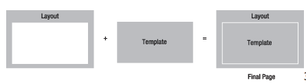

# Magento 2 layouts

В Magento страницы строятся посредством блоков с использованием шаблонов, которые имеют расширение *.phtml. Любой phtml файл является валидным html кодом. 
Конечный результат создается путем декорации, т.е. вставки одного блока в другой.



###Создание лэйаута для конкретного роутера

К примеру, у нас есть роутер с урлой /test-router/test-controller/test-action/ и нам необходимо в одноколоночном лэйауте вывести текст.
Для этого необходимо:

1. Создать новый PHP-класс для нового блока. Например:

```
<?php

#app/code/<VendorName>/<ModuleName>/Block/SomeName.php

namespace VendorName\ModuleName\Block;

class SomeName extends \Magento\Framework\View\Element\Template
{
    public function getWelcomeText()
    {
        return 'Hello World';
    }
}
```
В данном классе SomeName - произвольное название блока в CamelCase стиле. \Magento\Framework\View\Element\Template - класс, от которого наследуется этот блок, getWelcomeText - произвольный публичный метод, который возвращается текст для отображения на странице.

2. Добавить файл-шаблон:
```
#app/code/<VendorName>/<ModuleName>/view/frontend/templates/some-name.phtml

<h1><?php echo $block->escapeHtml($block->getWelcomeText()) ?></h1>
```

3. Объединить PHP-класс блока и файл-темплейта в лэйауте.

Для этого необходимо создать файл app/code/<VendorName>/<ModuleName>/view/frontend/layout/test-router_test-controller_test-action.xml.

```xml
<?xml version="1.0"?>

<page xmlns:xsi="http://www.w3.org/2001/XMLSchema-instance" layout="2columns-left" xsi:noNamespaceSchemaLocation="urn:magento:framework:View/Layout/etc/page_configuration.xsd">
     <body>
         <referenceContainer name="content">
             <block class="VendorName\ModuleName\Block\SomeName" name="some.block.name" template="VendorName_ModuleName::some-name.phtml" />
         </referenceContainer>
     </body>
</page>
```

Здесь:
- layout - атрибут, который указывает на тип макета страницы.  
  Доступные типы: 1column, 2columns-left, 2columns-right, 3columns, empty.
- content - название контейнера, в который будет помещен блок.

4. Создать контроллер с экшеном для вызова рендеринга лэйаута.
```
<?php

#app/code/<VendorName>/<ModuleName>/Controller/<ControllerName>/<ActionName>.php 

namespace VendorName\ModuleName\Controller\ControllerName;

class ActionName extends \Magento\Framework\App\Action\Action
{
     public function execute()
     {
        $this->_view->loadLayout();
        $this->_view->renderLayout();
    }
}
```