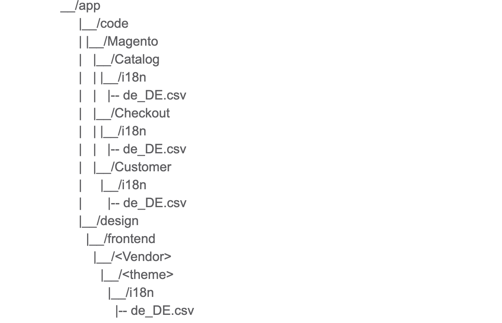

#Локализация в Magento 2

Переводы находятся в файлах .csv в модулях и темах. Например:



###Локализация строк в темплейтах UI-компонентов

Способы перевода строк в .html файлах Knockout-темплейтах:

1. Использование i18n-связывание: 
```   
<span data-bind="i18n: 'Sign In'"></span>
```

2. Использование аттрибута translate: 
```   
<span translate="'Sign In'"></span>
```

3. Использование виртуального биндинга knouckout.js:
```
<div class="component-wrapper">
   <!-- ko i18n: ‘Not’ -->
   <!-- /ko -->
</div>
```

4. Использование текстовой ноды: 
```   
<translate args="'You have no items in your shopping cart.'"/>
```
5. Когда строка добавлена как аттрибут HTML-элемента: 
```
<input type="text" data-bind="attr: {placeholder: $t('First Name')}" /> 
```

###Локализация строк в JS-файлах UI-компонентов

Способы перевода строк в .js файлах:

1. Использование jquery библиотеки mage:
```
require(['jquery','mage/translate'], function ($) {
  'use strict';
   alert($.mage.__('Test'));
});
```

2. Использование сокращения для вызова метода $.mage.__() вызовом метода $t():
```
require(['jquery','mage/translate'],function ($, $t) {
  'use strict';
   alert($t('Test'));
});
```

3. Использование плейсхолдеров в переводимых строках:

```
$.mage.__('Hello %1').replace('%1', yourVariable);
```
или
```
$t('Hello %1').replace('%1', yourVariable);
```

Нельзя сохранять строку для перевода в переменной. Например:

```
let msg = 'Hello %1'
$t(msg).replace('%1', yourVariable)
```

###Локализация строк в XML-файлах UI-компонентов

Необходимо указывать аттрибут translate="true" для элементов, которые подлежат переводу:

```
<action name="approve">
   <argument name="data" xsi:type="array">
       <item name="config" xsi:type="array">
           <item name="type" xsi:type="string">approve</item>
           <item name="label" xsi:type="string" translate="true">Approve</item>
       </item>
   </argument>
</action>
```

Для парсинга строк, которые подлежат переводу в файле /vendor/magento/module-translation/etc/di.xml определены правила поиска строк в файлах js и html:
```
<type name="Magento\Translation\Model\Js\Config">
        <arguments>
            <argument name="patterns" xsi:type="array">
                <item name="i18n_translation" xsi:type="string"><![CDATA[~(?:i18n\:|_\.i18n\()\s*(["'])(.*?)(?<!\\)\1~]]></item>
                <item name="translate_wrapping" xsi:type="string"><![CDATA[~translate\=("')([^\'].*?)\'\"~]]></item>
                <item name="mage_translation_widget" xsi:type="string"><![CDATA[~(?s)(?:\$|jQuery)\.mage\.__\(\s*(['"])(?<translate>.+?)(?<!\\)\1\s*(*SKIP)\)\s*(?s)~]]></item>
                <item name="mage_translation_static" xsi:type="string"><![CDATA[~(?s)\$t\(\s*(['"])(?<translate>.+?)(?<!\\)\1\s*(*SKIP)\)(?s)~]]></item>
                <item name="translate_args" xsi:type="string"><![CDATA[~translate args\=("|'|"'|\\"')([^\'].*?)('\\"|'"|'|")~]]></item>
            </argument>
        </arguments>
    </type>
```

Т.е., например, такой вариант работать не будет, т.к. нет подходящего правила для нахождения строки для дальнейшего перевода:
```
require(['jquery','mage/translate'],function ($, $translate) {
  'use strict';
   alert($translate('Test'));
});
```

Все переводы кэшируются на стороне клиента в локал-сторедже. Поэтому после замены перевода, его необходимо очищать для того,
чтобы появился измененный перевод.


###Компиляция переводов в продакшен режиме

В этом режиме необходимо, чтобы файл /pub/static/frontend/Magento/luma/en_US/js-translation.json был в актуальном состоянии.
Для этого необходимо запустить команду генерации статического контента для фронтенда и для определенного языка. Например:

```
bin/magento setup:static-content:deploy -o frontend en_US
```