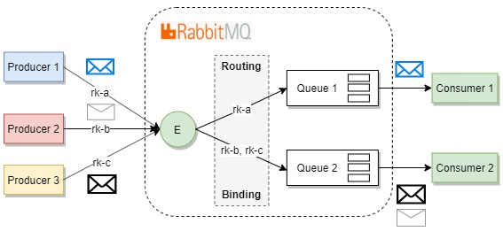
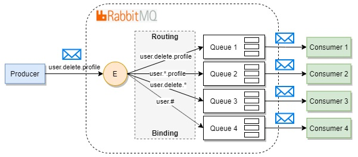
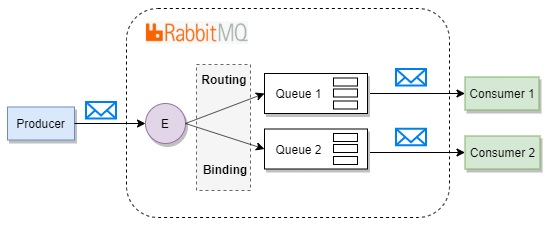

#Message Queues

###Создание субскрайбера и паблишера. Когда необходимо применять очередя.

Шаги для создания очереди:

1. В файле etc/queue_publisher.xml конфигурируем паблишера для отправки сообщений в топик.
2. Топик конфигурируется в файле etc/queue_publisher.xml для разделения сообщений на категории.
3. Субскрайбер конфигурируется для прослушивания сообщений определенной категории
4. Роутеры настраиваются в файле etc/queue_topology.xml
5. Субскрайберы принимают сообщения и обрабатывают их, настраиваются в файле etc/queue_consumer.xml

Какие файлы необходимо создать:

1. Паблишер создает операцию - класс, имплементирующий интерфейс \Magento\AsynchronousOperations\Api\Data\OperationInterface. 
   Операция отправляется в топик согласно роутеру.
2. Субскрайбер принимает операцию из очереди и обрабатывает ее.

Ассинхронный метод передачи сообщений напоминает метод передачи сообщений через ивенты. Т.к. подписчик на ивенты не может модифицировать сам ивент, 
то он стать субскрайбером сообщений из определенной очереди.

Например:

1. Отправка имейлов при создании ордера
2. Сохранение информации о продукте
3. Уменьшение количества продуктов на складе после совершения покупки


Также как и в подходе передачи сообщений через ивенты субскрайбер и паблишер не пересекаются. Когда субскрайбер оставляет сообщение в очереди, то оно хранится пока подписчик не получит его.
Для ассинхронной работы механизма применяется RabbitMQ, который предоставляет расширяемую платформу для приема/передачи сообщений.
Есть нативное рашение в коде Магенто без использования RabbitMQ-сервера - сохранение в таблицах базы данных (queue, queue_message, queue_message_status) и применение крон-задач для доставки сообщений подписчикам.
Это решение - не расширяемое, поэтому по-возможности необходимо применять RabbitMQ.

###Очереди сообщений
Очередь сообщений (message queue) - структура данных, которая обеспечивает хранение и передачу двоичных данных между различными участниками системы.
Очереди сообщений практически всегда используются в крупных системах, благодаря важным преимуществам:

- Независимость компонентов системы друг от друга. Благодаря использованию очереди, компоненты взаимодействуют через некий общий интерфейс, но ничего не знают о существовании друг друга.
- Экономия ресурсов достигается вследствие возможности разумно распределять информацию, поступающую в очередь от одних процессов, между другими процессами, осуществляющими её обработку. Кроме того, благодаря тому, что нет необходимости промежуточного хранения необработанных данных, достигается дополнительная экономия ресурсов.
- Надежность очередей достигается благодаря возможности накапливать сообщения, амортизируя недостаток вычислительных возможностей системы, а также благодаря независимости компонентов. Помимо этого очередь может аккомодировать сбои отдельных компонентов, осуществляя доставку «опоздавших» сообщений после восстановления.
- Гарантия последовательной обработки, позволяющая точно контролировать потоки данных в системе и запускать асинхронную обработку там, где это необходимо, не беспокоясь, что одна операция выполнится раньше другой, от результата которой она зависит.

###Почему используется RabbitMQ.
Причин несколько, но одна из основных — реализация приложения на платформе Erlang/OTP, гарантирующая максимальную стабильность и масштабируемость очереди, как ключевого узла всей системы. Другая причина — полная открытость приложения, распространяющегося по лицензии Mozilla Public License и реализация открытого протокола AMQP, библиотеки для которого существуют во всех основных языках и платформах программирования.

###Основные понятия

1. Брокер -  сам сервер RabbitMQ. Брокер может быть один, брокеров может быть несколько, объединённых в общий кластер (расширяемость). 
   Брокер занимается непосредственно передачей сообщений. Однако на внутреннем уровне происходит намного больше процессов, нежели просто передача байтиков по сети.
   
2. Очередь - основной логический компонент брокера. Именно из очереди клиент (consumer) забирает сообщения. 

3. Биржа  (обменник) -  играет важнейшую роль в направлении сообщений от отправителя (producer) к клиенту (consumer, он же потребитель). Благодаря бирже, поступающее от отправителя сообщение направляется в нужную очередь.
Если сообщение обработано подписчиком на него, то необходимо отправить на биржу респонс со статусом ack. Если необходимо заново обработать сообщение в рамках того же коннекта к серверу сообщений, то необходимо вызвать метод nack() с флагом AMQP_REQUEUE, который поставит неудачно обработанную задачу обратно в очередь и уведомит брокер о том, что эта задача должна быть вновь обработана.
   
Для того, чтобы отправлять сообщения всем клиентам сразу - необходимо создать биржу типа fanout.

###Direct Exchange

Самый простой и быстродейственный способ доставки сообщений в определенный по имени очередь. 
Сообщение публикуется в обменник с определенным ключом маршрутизации и попадает во все очереди, 
которые связаны с этим обменником аналогичным ключом маршрутизации. Ключ маршрутизации — это строка. 
Поиск соответствия происходит при помощи проверки строк на эквивалентность.

Графическое представление потока сообщений:



В rabbitmq существует понятие обменник по умолчанию. Это direct exchange без имени. 
Если применяется обменник по умолчанию, то сообщение будет маршрутизироваться в очередь с именем равным ключу маршрутизации сообщения.

###Topic Exchange

Topic exchange – аналогично direct exchange дает возможность осуществления выборочной маршрутизации путем сравнения ключа маршрутизации. Но, в данном случае, ключ задается по шаблону. При создании шаблона используются 0 или более слов (буквы AZ и az и цифры 0-9), разделенных точкой, а также символы * и #.

1. \* — может быть заменен на ровно 1 слово
2. \# — может быть заменен на 0 или более слов

Графическое представление потока сообщений:



Особенности:

- применение этого обменника может стать хорошим выбором для возможного будущего развития приложения, т.к. шаблоны всегда можно настроить так, чтобы сообщение публиковалось аналогично direct exchange или fanout exchange
- шаблоны, которые используют * намного быстрее, чем шаблоны, которые используют #.
- topic exchange медленнее direct exchange

###Fanout Exchange

Fanout exchange – все сообщения доставляются во все очереди даже если в сообщении задан ключ маршрутизации.

Особенности:

- RabbitMQ не работает с ключами маршрутизации и шаблонами что положительно влияет на производительность. Это самый быстрый exchange;
- все потребители должны иметь возможность обрабатывать все сообщения;

Графическое представление потока сообщений:



Модули Магенто для работы с ассинхронными сообщениями:

1. magento/framework-message-queue - содержит абстрактные классы, которые используются в различных имплементациях механизма ассинхронных сообщений
2. magento/module-message-queue - содержит классы для листинга и запуска подписчиков
3. magento/module-mysql-mq - содержит классы для адаптера базы данных
4. magento/module-amqp - содержит классы для адаптера AMQP, например, RabbitMQ

Какие необходимо создать конфигурационные файлы в папке /etc модуля для реализации очереди сообщений:

- communication.xml - определяет общие аспекты любого способа реализации очередей
- queue_consumer.xml - определяет отношения между существующей очередью и ее подписчиками
- queue_topology.xml - определяет правила роутинга, очереди и обменники
- queue_publisher.xml- определяет обменник, куда паблишить сообщения топика

В этих файлах можно конфигурировать какие паблишеры будут использовать соединения для отправки сообщений. Например, в файле queue_publisher.xml:

```
<?xml version="1.0"?>
<config xmlns:xsi="http://www.w3.org/2001/XMLSchema-instance" xsi:noNamespaceSchemaLocation="urn:magento:framework-message-queue:etc/publisher.xsd">
    <publisher topic="magento.testModuleSynchronousAmqp.api.serviceInterface.execute" disabled="true" />
    <publisher topic="asynchronous.test">
        <connection name="amqp" exchange="magento" disabled="false"/>
        <connection name="db" exchange="exch1" disabled="true"/>
    </publisher>
</config>
```
Управлять подписчиками при использовании нативных средств коммуникации через базу данных не эффективно в Магенто. Поэтому лучше использовать соединение через RabbitMQ.
Например, есть баг https://github.com/magento/magento2/issues/23540. Т.е. для управления воркерами лучше использовать сторонние средства для их старта, стопа, перезапуска. Например, Supervisor.
В нашем небольшом примере будем поднимать воркеры через консольную команду.
В данном снипете в папке (examples/SampleMessageQueue) прикреплен пример работы с ассинхронными сообщения посредством amqp-транспорта.

Для тестирования работы модуля необходимо:

1. Установить RabbitMQ-сервер. Например, в Убунту sudo apt install -y rabbitmq-server
   
2. Добавить параметры для соединения с сервером. В файле <install_directory>/app/etc/env.php добавить:
```
'queue' => [
        'amqp' => [
            'host' => 'localhost',
            'port' => '5672',
            'user' => 'guest',
            'password' => 'guest',
            'virtualhost' => '/'
        ]
    ],
```

И запретить запуск консьюмеров по крону:
```
'cron_consumers_runner' => [
        'cron_run' => false,
        'max_messages' => 20000,
        'consumers' => [

        ]
    ],
```
3. зайти на сайт по урле /queue_test
4. открыть файл с кастомными логами /var/log/sample_queues.log
5. должны быть 2 записи - строка лога, что данные записаны в обменник, другая - что подписчик взял эти данные из очереди на обработку
6. Запустить консьюмеров в консоле php bin/magento queue:consumer:start new_customer.created --max-messages=1