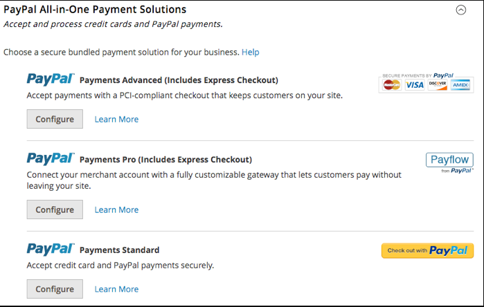
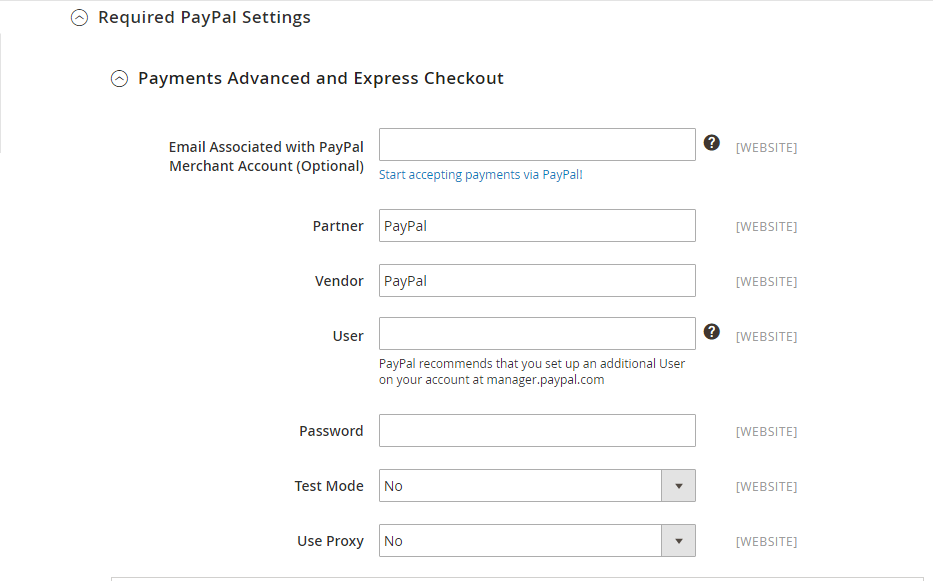
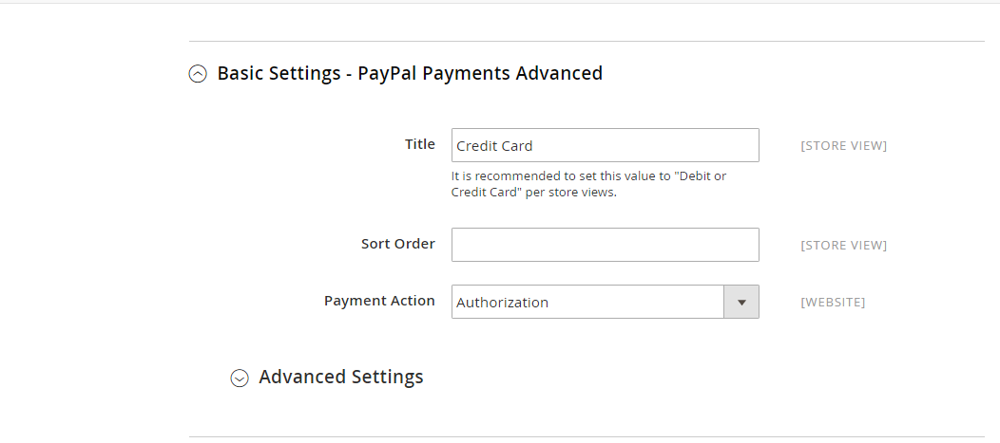
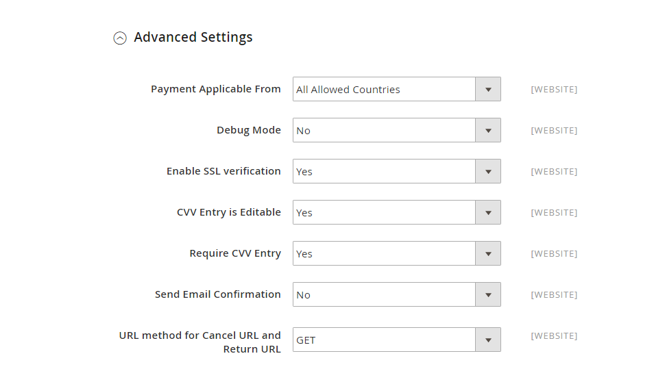
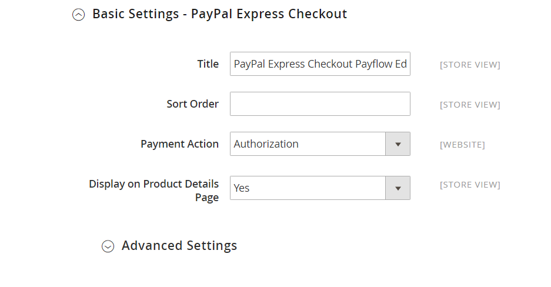

#Платежные системы

##Обзор стандартных методов оплаты Magento

###Paypal

В Magento с коробки есть различные способы оплаты, при помощи которых можно принимать платежи через разные системы оплаты, 
например Paypal или Authorize.net. Также, клиенты могут оплатить покупки используя обычную кредитную карту, 
например Visa, Master Card, American Express, Discover, а также оплатить чеком/наличными, Наложенным платежом или иными способами.

Для того чтобы настроить способы оплаты в Magento в Админ панели необходимо перейдите на вкладку Система -> Настройка -> Продажи -> Способы оплаты (System -> Configuration -> Sales -> Payment Methods).
1. В этом разделе начните с настройки Страна торговца где будет расположен ваш магазин Magento.
2. Paypal является одним из наиболее предпочтительных способов оплаты на большинстве платформ, и это идеальный выбор для Magento 2.
PayPal предлагает три варианта оплаты в Magento 2:

- PayPal Payments Advanced
- PayPal Payments Pro
- PayPal Payments Standard

Для того чтобы принимать платежи по Paypal необходимо произвести настройки этих 3 разделов. Они находятся в секции Платежные решения "все в одном" PayPal.

3.Чтобы сделать Paypal способом оплаты в магазине Magento, нажмите Настройка кнопка. Вам будет предложено три небольших пункта меню, которые необходимо настроить:

- Обязательная настройка PayPal
- Основные настройки – PayPal Payments Advanced
- PayPal Express Checkout

####Вариант 1. Обязательные настройки PayPal.
Обязательно заполните следующие поля: Электронная почта, связанная с учетной записью PayPal Merchant, партнером, поставщиком, пользователем, а также пароль.

Чтобы проверить, как работает этот параметр, прежде чем включить его, отметьте Режим тестирования в Да, затем переключитесь на Нет, как только вы будете готовы.

Если вы хотите подключить вашу систему к PayPal через прокси-сервер, установите Используй прокси на «Да». Затем вам необходимо настроить IP-адрес и номер порта прокси-хоста для прокси-порта.

####Вариант 2. Основные настройки – расширенный платеж PayPal

Вам необходимо будет ввести свою кредитную и дебетовую карту в поле Заголовок. Порядок сортировки Опция позволяет установить характер способа оплаты, если клиенты переходят на страницу оформления заказа..

Платежное действие предлагает два варианта: авторизация а также Продажа. Выбирая авторизация, Вы принимаете условия заказа и соглашаетесь получать оплату, как только вы принимаете вручную в бэкэнде. Продажа режим позволит системе автоматически получать платеж со счета клиента.

Расширенные настройки

В разделе «Дополнительные настройки» отображаются следующие сведения:

Установить Форма заявки на оплату чтобы разрешить эти детали:

- Все разрешенные страны: Означает, что вы можете принимать платежи из всех стран, представленных в конфигурации.
- Конкретные страны: В этом разделе укажите конкретные страны, из которых вы можете получать оплату.
- Режим отладки должен быть установлен на “Да” собрать данные о платежах в ваш лог-файл (payments_payflow_advanced.log).
- Включить проверку SSL раздел к “Да.” активировать проверку подлинности хоста.
- Набор Требовать CVV Entry в “Да” так что клиенты могут ввести свой код CVV здесь.
- Три дополнительных варианта доступны для редактирования в плане Paypal. Они включают:
- Подтверждение отправки электронной почты, запись CVV редактируемая, метод URL для URL отмены и URL возврата (либо GET, либо POST).

Приведенные выше URL «Отмена» и «Возврат» описывают место, куда клиенты могут вернуться после завершения или отмены платежа во время оформления заказа на сервере PayPal..

Кроме того, заполните необходимые поля в вашем магазине Magento:

- Настройки отчета о расчетах
- Настройки внешнего интерфейса

####Вариант 3: Основные настройки - PayPal Express Checkout

Это позволяет вам взаимодействовать с миллионами других активных пользователей PayPal по всему миру..

Чтобы совершить покупку с помощью этой опции, перейдите PayPal Express Checkout и сделайте следующее:

- Введите Название PayPal для каждого вида магазина.
- в Порядок сортировки В разделе введите номер для представления экспресс-оплаты.
- Установить Платежное действие либо авторизация или Продажа.
  
        «Продажа» означает то, что деньги со счёта клиента будут списаны, как только клиент делает покупку. Это проще, чем использование авторизации, и рекомендуется большинством продавцов.
        
        «Авторизация» означает то, что банк убедится, что у клиента есть достаточно денег для совершения покупки и что эти средства будут доступны в течении следующих трёх (3) дней. Однако, Вам всё ещё нужно будет снять эти средства позже в процессе проведения платежа (payment capture). Например, это удобно, если Вы не хотите снимать деньги со счетов клиентов, пока товар не был к Вам доставлен.
  
- Затем установите для параметра «Отображение на странице сведений о продукте» значение «Да», 
  чтобы отобразить Оформить заказ через PayPal кнопка на странице вашего продукта.
  

###Наложенный платёж (Cash on Delivery)

- Для того чтобы активировать способ оплаты, задайте параметру Включено (Enabled) значение «Да».

- В поле Название (Title), заполните ‘Наложенный платёж’, для того чтобы обозначить этот способ в процессе оформления заказа.

- Задайте параметру Статус нового заказа (New Order Status) значение ‘В обработке’, для того чтобы все новые заказы имели статус «В обработке» пока покупка не оплачена.

- В поле Платёж из разрешенных стран (Payment from Applicable Countries) определите страны, в которых доступна оплата наложенным платежом, или просто выберите ‘Все разрешенные страны’.

- В поле Инструкция (Instructions) вы можете добавить руководство для клиентов о том, как использовать способ оплаты «Наложенный платёж».

- В полях Минимальная общая сумма заказа (Minimum Order Total) и Максимальная общая сумма заказа (Maximum Order Total) задайте минимальную и максимальную общую сумму заказа для способа доставки «Наложенный платеж».

- В поле Порядок отображения (Sort Order) Вы можете задать порядок отображения способа оплаты «Наложенный платёж» в списке способов оплаты на странице оформления заказа.

###Чек/Платёжное поручение (Check / Money Order)

В некоторых регионах оплата наложенным платежом может быть недоступна, или клиенту нужно приобрести больше товара, чем максимально допустимое количество для оплаты наложенным платежом. Поэтому, лучше использовать более всеохватывающий и распространённый способ оплаты для интернет-магазинов – Чек/Платёжное поручение (Check / Money Order):

- Задайте параметру «Включен» значение Да, для того чтобы включить этот способ оплаты.

- Введите узнаваемое название в поле «Название», для того чтобы клиенты могли опознать этот метод в процессе оформления заказа. Вы можете также использовать значение по умолчанию.

- Задайте статус нового заказа — «В обработке», для того чтобы новые заказы оставались незавершенными, пока оплата не произведена.

- В поле «Платёж для доступных стран» выберите страны, где доступен этот метод оплаты.

- Все разрешенные страны: Клиенты из всех стран из списка разрешенных стран могут использовать данный способ оплаты.

- Определённые страны: Клиенты из списка выбранных стран могут использовать этот способ оплаты. Список доступных стран отобразится после выбора данной опции.

- В поле «Сделать чек на…», введите имя того, кому будут выплачены деньги по чеку.

- В поле «Послать чек…» (Send Check To), введите полный адрес, на который должен быть отправлен чек.

- В поле «Минимальная общая сумма заказа» (Minimum Order Total) введите минимальную сумму заказа, при которой доступна оплата чеком или платёжным поручением.

- В поле «Максимальная общая сумма заказа» (Maximum Order Total) укажите максимальную общую сумму заказа, для которой доступна оплата Чеком/Платёжным поручение.

- Для того чтобы определить порядок отображения способа оплаты «Чек/Платёжное поручение» в списке способов оплаты при оформлении заказа, введите числовое значение в поле «Порядок отображения».

- Меньшее значение имеет больший приоритет и занимает более высокую позицию в списке.

###Банковский перевод (Bank Transfer Payment)

Способ оплаты «Банковский перевод» безопасен как для ваших клиентов, так и для вашего сайта Magento. Давайте рассмотрим некоторые плюсы и минусы.

Однако, платёж не возмещается без вашего согласия.

Также, этот способ достаточно затратный, так как комиссия за банковский перевод достаточно высока.

Более того, данный способ оплаты требует много времени, так как переведённые средства могут оказаться на вашем счёте через 3-5 рабочих дней.

- Для того чтобы активировать способ оплаты, задайте параметру Включено (Enabled) значение «Да»:

- В поле Название (Title), введите ‘Оплата банковским переводом’, для того чтобы клиенты могли опознать этот метод в процессе оформления заказа.

- Задайте статус нового заказа — «В обработке», для того чтобы новые заказы оставались незавершенными, пока оплата не произведена.

- В поле Платёж для разрешенных стран (Payment from Applicable Countries) определите страны, для которых доступен способ оплаты «Банковский перевод» или просто выберите ‘Все разрешенные страны.

- В поле Инструкции (Instructions) добавьте советы для клиентов по использованию способа оплаты «Банковский перевод». Не забудьте предоставить детали названия вашего счёта и номер счёта, Код маршрутизации банка, название банка и адрес.

- В полях Минимальная общая сумма заказа (Minimum Order Total) и Максимальная общая сумма заказа (Maximum Order Total) задайте минимальную и максимальную общую сумму заказа для способа доставки «Банковский перевод».

- В поле Порядок отображения (Sort Order)Вы можете определить порядок способа оплаты «Банковский перевод» в списке способов оплаты на странице оформления заказа.

###Оформление заказа с нулевым итогом (Zero Subtotal Checkout)

Оформление заказа с нулевым итогом (Zero Subtotal Checkout) доступно только для заказов, созданных администратором и может быть использовано для заказов с итогом ноль.

В отличие от других способов оплаты, для которых Вы можете установить фильтры количества заказа, этот способ оплаты содержит внутренний фильтр количества заказа, так что этот способ отобразится только тогда, когда промежуточный итог равен нулю. «Оформление заказа с нулевым итогом» может быть использовано в таких случаях:

- Товар, который клиент добавляет в корзину Скачиваемый или Цифровой и его цена равняется нулю.

- Цена обычного товара равна нулю и доступна Бесплатная доставка.

- Код купона покрывает полную цену товара и доставка включена в заказ.

- В корзине использован подарочный сертификат и он полностью покрывает сумму заказа, включая доставку. Во время оформления заказа, который покрывается подарочным сертификатом, клиент должен будет выбрать способ оплаты «Данные не требуются» в разделе «Информация о платеже» страницы оформления заказа.

Для того чтобы настроить Оформление заказа с нулевым итогом, следуйте таким инструкциям:

- Введите Название, которое поможет клиентом опознать этот способ оплаты во время оформления заказа.

- Способ оплаты «Банковский перевод» безопасен как для ваших клиентов, так и для вашего сайта Magento. Давайте рассмотрим некоторые плюсы и минусы.

- Задайте Статус нового заказа следующим образом:

В ожидании (по умолчанию) (Pending (Default)): заказ ожидает подтверждения.

В обработке (Processing): Заказ подтвержден, сделка обрабатывается.

- Задайте параметру «Автоматически выписывать счёт для всех товаров» значение «Да», если Вы хотите автоматически выписывать счёт для всех товаров с нулевой ценой.

- Задайте параметру «Оплата из доступных стран» одно из следующих значений:

Все разрешенные страны (All Allowed Countries): Клиенты из всех стран, указанных в настройках вашего магазина, могут использовать этот способ оплаты.

Определённые страны (Specific Countries): Выбрав этот вариант, Вы увидите список стран. Выберите страны из списка, в которых клиенты могут делать покупки из вашего магазина.

- Введите Порядковый номер, для того чтобы определить позицию «Оформление заказа с нулевым итогом» в списке способов оплаты на странице оформления заказа. (0 = первый, 1 = второй, 2 = третий, и т. д.)

###Authorize.net - Deprecated

Данный метод оплаты запрещен с версии 2.3. 

###Authorize.Net Direct Post - Deprecated

Данный метод оплаты запрещен с версии 2.3.

###Braintree - Deprecated

Данный метод оплаты запрещен с версии 2.3. 

###CyberSource - Deprecated

Данный метод оплаты запрещен с версии 2.3. 

###eWAY - Deprecated

Данный метод оплаты запрещен с версии 2.3. 

###Worldpay - Deprecated

Данный метод оплаты запрещен с версии 2.3. 

###Klarna

Klarna - шведский поставщик платежных услуг, который берет на себя полную ответственность за ваш платеж. Klarna является поставщиком платежей Smoooth в более чем 170 000 интернет-магазинов. Более 60 миллионов потребителей по всему миру доверили Klarna безопасную обработку своих платежей.
Klarna предлагает продавцам и покупателям свои услуги по отложенной оплате товара. Продавец получает оплату сразу – а покупателю предоставляется отсрочка в две недели. Для покупки ему требуется всего лишь ввести свой e-mail адрес, адрес доставки товара и номер телефона. В качестве приятного бонуса это экономит вам время, позволяя вбивать меньше информации, пользуясь клавиатурой смартфона. А по сути, отсрочка в 14 дней при сроках доставки в 1-3 дня означает, что вы оплачиваете товар после получения.

Суть системы в том, что Klarna по введённым вами данным мгновенно составляет ваш онлайн-портрет и определяет, достойны ли вы такой отсрочки, пользуясь своими внутренними процедурами оценки благонадёжности. Кроме этого, компания выступает посредником в платежах, на манер PayPal принимая и сохраняя данные о вашей банковской карте, чтобы вам не пришлось вводить их каждый раз. Генеральный директор компании, Себастьян Семятковский (Sebastian Siemiatkowski) говорит, что этот процесс похож на «Amazon One Click» для онлайн-продавцов.

1. Настройка API Configuration
   

Поддерживаемые страны - AT, DE, DK, FI, NL, NO, SE, US, AU, NZ.
Для тестовых транзакций выбрать способ - Playground.
В тестовом режиме можно включить логирование.

2. Конфигурирование настроек оплаты
   
   
Поддерживается B2B.
Есть возможность сохранять билллинг и шипинг данные на стороке Кларна после совершения транзакции.

3. Конфигурирование дизайна
   

###Amazon Pay

Amazon Pay или Amazon Payments популярен, потому что, как и PayPal, очень легко зарегистрироваться и интегрировать систему на свой веб-сайт. Вам понадобится учетная запись Amazon в качестве продавца, чтобы использовать ее, хотя вам не обязательно указывать продукты для продажи на Amazon. 

Настройки:

1. Права доступа

Есть возможность использовать тестовую среду. Необходимо выбрать Sandbox - Yes.
Если не включать Sandbox, то можно настроить права доступа для продакшена.
2. Установка опций
   
- Payment Action - Charge on Shipment или Charge on Order.
- Authorization Mode - Immediate или Automatic.
- Update Mechanism - Data Polling via Cron job или Instant Payment Notifications.

3. Продвинутые настройки
   
   
   
   
   

